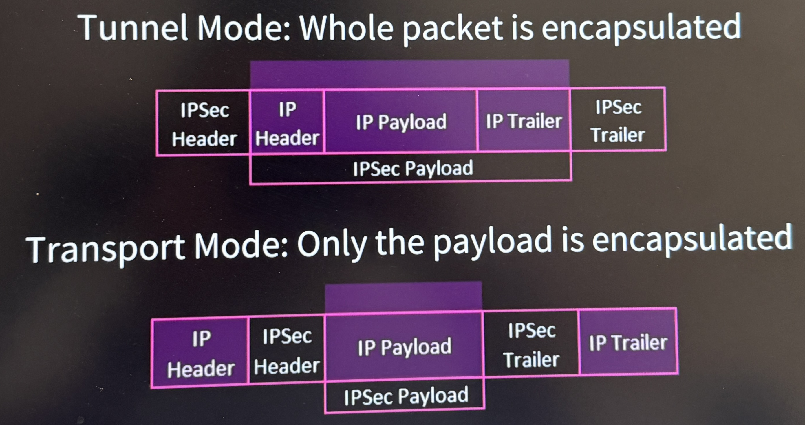

# Module 3 – Security Architecture  

## 3.1 Cloud Computing  

**NIST SP 800-145 Definition**  
> “Cloud computing is a model for enabling ubiquitous, convenient, on-demand network access to a shared pool of configurable computing resources (e.g., networks, servers, storage, applications, and services) that can be rapidly provisioned and released with minimal management effort or service provider interaction.”  

---

## 🌩️ Cloud Drivers (Why Cloud Computing?)  
- Scalability  
- Mobility  
- Elasticity  
- Cost-saving  
- Risk transference / reduction  
- Reduced infrastructure  
- Less overhead  
- Pay-as-you-go  
- Shifting capital expenditure → operational expenditure  

---

## 🛠️ Cloud Service Models (What service the provider delivers)  

### 1. Software as a Service (SaaS)  
- Consumer uses the provider’s applications running on cloud infrastructure.  
- Accessible via web browser or app interface.  
- **You manage**: only your data/input & usage.  
- **Provider manages**: everything else.  
- **Examples**: Google Workspace, Salesforce, Dropbox.  

---

### 2. Platform as a Service (PaaS)  
- Consumer deploys applications on cloud infrastructure using provider-supported programming languages, libraries, services, and tools.  
- **You manage**: your applications & data.  
- **Provider manages**: OS, runtime, servers, networking, storage.  
- **Examples**: Google App Engine, Microsoft Azure App Service, Heroku.  

---

### 3. Infrastructure as a Service (IaaS)  
- Provides raw infrastructure: servers, storage, networking.  
- **You manage**: OS, apps, configurations, storage.  
- **Provider manages**: hardware, virtualization, networking.  
- **Examples**: AWS EC2, Azure VM, Google Compute Engine.  

---

## ☁️ Cloud Deployment Models (How & where the cloud is deployed)  

### 1. Public Cloud  
- **Users**: Multi-tenant (shared by many organizations).  
- **Pros**:  
  - Cost-effective (pay-as-you-go)  
  - High scalability & elasticity  
  - No hardware maintenance  
- **Cons**:  
  - Less control over infrastructure  
  - Security & compliance concerns  
- **Examples**: AWS, Azure, GCP  

---

### 2. Private Cloud  
- **Users**: Single-tenant (exclusive use).  
- **Pros**:  
  - More control & customization  
  - Better for compliance & sensitive workloads  
- **Cons**:  
  - Higher cost (must build/manage resources)  
  - Less scalability compared to public cloud  
- **Examples**: VMware Private Cloud, OpenStack  

---

### 3. Hybrid Cloud  
- Combines **public + private** with orchestration between them.  
- **Pros**:  
  - Balance of cost & security  
  - Disaster recovery / backup flexibility  
  - Sensitive data stays private, while scaling apps in public cloud  
- **Cons**:  
  - Complex integration & management  
- **Examples**: AWS Outposts, Azure Stack, Google Anthos  

---

### 4. Community Cloud  
- Infrastructure shared by organizations with common interests (e.g., compliance, mission, security).  
- **Users**: Multiple organizations, usually within the same sector.  
- **Pros**:  
  - Shared cost among community  
  - Tailored for industry needs (healthcare, government, research)  
- **Cons**:  
  - Limited scalability compared to public cloud  
  - Shared resources may raise security concerns  

---

## 🔑 Quick Comparison  

| Aspect              | Service Models (IaaS / PaaS / SaaS) | Deployment Models (Public / Private / Hybrid / Community) |
|---------------------|--------------------------------------|-----------------------------------------------------------|
| **Focus**           | What service is delivered            | Where and how cloud is deployed                           |
| **Defines**         | Level of control & responsibility    | Ownership, accessibility, location                        |
| **Examples**        | SaaS = Gmail, PaaS = Heroku, IaaS = AWS EC2 | Public = AWS, Private = VMware, Hybrid = Azure Stack, Community = Gov Cloud |
| **Question**        | *What am I consuming?*               | *Where is it running, and who shares it?*                 |

## 3.2 Data Security in the Cloud  

### Protecting Data Moving to and Within the Cloud  
- **Encryption protocols**: SSL / TLS / IPSec  

---

### 🔐 CASB (Cloud Access Security Broker)  
A security tool/service that sits between cloud service users and cloud applications to enforce security, compliance, and governance policies.  

**Functions:**  
1. **Visibility**  
   - Shows who is using which cloud apps (approved & shadow IT).  
   - Detects risky or unauthorized usage.  

2. **Compliance**  
   - Ensures compliance with regulations (GDPR, HIPAA, PCI-DSS).  
   - Monitors & reports data handling for audits.  

3. **Data Security**  
   - Protects sensitive data with encryption, tokenization, or DLP (Data Loss Prevention).  
   - Prevents data leaks (e.g., uploading sensitive files to Dropbox).  

4. **Threat Protection**  
   - Detects suspicious activity (account hijacking, malware in cloud apps).  
   - Uses anomaly detection & threat intelligence.  

---

### 🛡️ Protecting Data in the Cloud  
- **Encryption**: Protects confidentiality of data.  
- **DLP (Data Loss Prevention)**: Detects and prevents unauthorized data movement to cloud.  
- **Data Dispersion**: Data is replicated across multiple physical locations → higher availability.  
- **Data Fragmentation**: Splits a dataset into smaller fragments/shards and distributes across many machines.  
- **Cryptoshredding**: Renders encrypted data inaccessible by deleting encryption keys (data remnants are unusable).  

## 3.3 Additional Architectures  

### ⚙️ Infrastructure as Code (IaC)  
Define your infrastructure with code → automated, versioned, repeatable.  

**Key Points:**  
- **Automation**: Faster, consistent deployment.  
- **Consistency**: Same config file = same environment.  
- **Version Control**: Store IaC files in Git.  
- **Scalability**: Easy to replicate infra for dev, test, prod.  
- **Compliance**: Policies embedded in code for auditing.  

**Tools:** Terraform, AWS CloudFormation, Ansible, Puppet, Chef  

---

### ⚡ Serverless Architecture  
Focus only on **functions / code**, provider handles the infrastructure.  

**Key Characteristics:**  
- No server management (abstracted away).  
- Event-driven (triggers: HTTP request, DB update, file upload).  
- Automatic scaling.  
- Pay-per-use (execution time & resources, not idle servers).  
- Short-lived, stateless functions.  

**Relation to Cloud Models:**  
- Often considered an extension of **PaaS**, sometimes called **FaaS**.  
- Difference: In PaaS, you still manage runtime; in Serverless, only code/events.  

**Examples:** AWS Lambda, Azure Functions, Google Cloud Functions  

---

### 🧩 Microservices Architecture  
Instead of one monolithic app, break into many **loosely coupled services**, each responsible for a function.  

**Key Characteristics:**  
- Independent services (develop, deploy, scale separately).  
- Decentralized data (each service may have its own DB).  
- Communicate via APIs (REST, gRPC, message queues).  

**Benefits:** Scalability, flexibility, faster releases, resilience.  
**Challenges:** Complexity, inter-service networking, data consistency, DevOps overhead.  

---

### 🌐 Virtual Local Area Networks (VLANs)  
Logical segmentation of a physical network into **smaller, isolated networks**.  

**Why VLANs?**  
- **Segmentation**: Separate groups (HR, Finance, Students, Guests).  
- **Security**: Prevents unauthorized communication between groups.  
- **Efficiency**: Smaller broadcast domains → less traffic.  
- **Flexibility**: Devices don’t need physical proximity; grouped logically.  

**Key Concepts:** VLAN ID, Access Port, Trunk Port (802.1Q tagging), Inter-VLAN routing.  

---

### 🖧 Software-Defined Networking (SDN)  
Network architecture that separates the **control plane** from the **data plane**.  

**Key Characteristics:**  
1. **Separation of Planes**  
   - Control Plane = decides where traffic goes (brains).  
   - Data Plane = forwards traffic (muscles).  
   - Centralized in a controller, not per-device.  

2. **Centralized Management**  
   - Single SDN controller manages the entire network.  
   - Global view → easier automation, policy enforcement.  

3. **Programmability**  
   - Network defined by software APIs.  
   - Dynamic changes: scale bandwidth, reroute traffic, enforce security.  

4. **Open Standards**  
   - Uses protocols like **OpenFlow** to link controller & devices.  

**Benefits:** Agility, automation, centralized security, cost-effective.  
**Challenges:** Controller as single point of failure, complexity, security risks.  

**Examples:** Cisco ACI, VMware NSX, OpenDaylight, Google B4 WAN  

## On-Premises Architectures  

### 🏢 On-Premises (本地部署)  
Infrastructure hosted in the organization’s own data center, fully owned and managed by the organization (hardware, servers, storage, networking, security).  

---

### 🔑 Key Concepts  

#### 1. Centralization vs Decentralization  
- **Centralization**:  
  - Resources and infrastructure are consolidated in a single data center.  
  - Easier to manage and secure, but creates a single point of failure.  
- **Decentralization**:  
  - Resources are distributed across multiple sites.  
  - Increases redundancy and resilience but adds management complexity.  

---

#### 2. Logical Isolation  
- Separation of resources within the same physical infrastructure.  
- Achieved via **VLANs, firewalls, access controls, or hypervisor-level separation**.  
- Prevents one system from directly accessing another without proper authorization.  

---

#### 3. Virtualization vs Containerization  
- **Virtualization**: Runs multiple **VMs** on a single physical machine, each with its own OS.  
  - Example: VMware, Hyper-V, KVM.  
  - Good for isolation but heavier (requires more resources).  
- **Containerization**: Runs multiple **containers** on the same OS kernel.  
  - Example: Docker, Kubernetes.  
  - Lightweight, faster startup, easier scaling, but shares OS kernel (less isolation than VMs).  

---

#### 4. Physical Security  
- Protecting infrastructure with **restricted access, surveillance, biometrics, and guards**.  
- Physical measures ensure servers are not tampered with.  

**Air Gaps**:  
- A security practice where a system/network is **physically isolated** from unsecured networks (like the internet).  
- Often used in **military, nuclear, and high-security environments**.  

---

### ✅ Summary  
On-Premises = full control and ownership of infrastructure. Organizations must handle **management, security, and scalability** themselves. Concepts like **centralization, isolation, virtualization, and physical air-gapping** play a major role in designing secure on-prem deployments.  

## 3.4 Architecture Considerations

- **Availability** – Ensure the system is accessible when needed.  
- **Resilience** – Ability to withstand failures and continue operating.  
- **Cost** – Financial considerations for design and operation.  
- **Responsiveness** – How quickly the system reacts to requests.  
- **Scalability** – Ability to grow and handle increased demand.  
- **Ease of deployment** – How easily new systems/services can be deployed.  
- **Risk transference** – Shifting risks to third parties (e.g., insurance, cloud).  
- **Ease of recovery** – Speed and simplicity of restoring operations after disruption.  
- **Patch availability** – Vendor-provided updates and fixes.  
- **Ability to patch** – How easily patches can be applied to the system.  
- **Power** – Energy requirements and availability.  
- **Compute** – Processing capacity to meet workload demands.

## 3.5 IDS and IPS

### Intrusion Detection System (IDS)
- **Types**:
  - **HIDS (Host-based IDS)** – Monitors activity on individual systems.
  - **NIDS (Network-based IDS)** – Monitors network traffic across the network.  
- **Function**:
  - Monitors for signs of an attack.
  - Only reports if it finds anything (no prevention).
- **Analysis Techniques**:
  - **Signature-based** – Detects patterns of known attacks.
  - **Anomaly-based** – Detects deviations from normal behavior.
  - **Behavior-based** – Monitors actions/behaviors that resemble attacks.

---

### Intrusion Prevention System (IPS)
- **Types**:
  - **NIPS (Network Intrusion Prevention System)** – Positioned in-line to inspect and block network traffic.
  - **Wireless IPS** – Can block unknown/unauthorized wireless devices.
- **Function**:
  - A step beyond IDS — reacts to events it detects.
  - Can reset connections or block malicious traffic.
  - Must be placed **in-line** to actively prevent threats.

## 3.6 Firewalls

### Security Zones
A fundamental requirement in network security is to **isolate trusted resources from untrusted entities**.  
Networks are segmented into zones based on trust:

- **LAN (Trusted)** – Internal network, highest trust.
- **DMZ (Screened Subnet / Semi-Trusted)**  
  - Buffer zone between an unprotected network (internet) and a protected network.  
  - Internet-accessible servers (bastion hosts) are placed in the DMZ.  
- **Internet (Untrusted)** – Lowest trust, public access.

---

### Firewall Basics
- A firewall uses **rule-based access control** to evaluate traffic and allow or deny based on predefined criteria.  
- **Types**:
  - **Web Application Firewalls (WAF)** – Protect web apps from SQL injection, XSS, etc.  
  - **Forward Proxy** – Inspects traffic going from the internal network out to the internet.  
  - **Reverse Proxy** – Inspects traffic coming from the external network into the internal network.  

---

### Configuring Firewall Rules

**Task**: Configure four rules on the firewall.

1. **Allow Accounting → Admin Server 1 via HTTPS**  
   - Source: `10.18.255.10/24` (Accounting subnet)  
   - Destination: `10.18.255.101` (Admin Server 1)  
   - Port: `443 TCP` (HTTPS)  
   - Action: **Allow**

2. **Allow HR → Server 2 via SCP (SSH)**  
   - Source: `10.18.255.10/23` (HR subnet)  
   - Destination: `10.18.255.2` (Server 2)  
   - Port: `22 TCP` (SCP uses SSH)  
   - Action: **Allow**

3. **Allow IT → Admin Server 1**  
   - Source: `10.18.255.10/25` (IT subnet)  
   - Destination: `10.18.255.101` (Admin Server 1)  
   - Port: *Any*  
   - Action: **Allow**

4. **Allow IT → Admin Server 2**  
   - Source: `10.18.255.10/25` (IT subnet)  
   - Destination: `10.18.255.102` (Admin Server 2)  
   - Port: *Any*  
   - Action: **Allow**

---

### Example Firewall Rule Table

| Source IP/Subnet   | Destination IP   | Port Number | Protocol | Action |
|--------------------|------------------|-------------|----------|--------|
| 10.18.255.10/24    | 10.18.255.101    | 443         | TCP      | Allow  |
| 10.18.255.10/23    | 10.18.255.2      | 22          | TCP      | Allow  |
| 10.18.255.10/25    | 10.18.255.101    | Any         | TCP/UDP  | Allow  |
| 10.18.255.10/25    | 10.18.255.102    | Any         | TCP/UDP  | Allow  |

## 3.7 Zero Trust

- **Definition**: A newer trend in network security that assumes **no inherent trust** — every entity must authenticate before access is allowed.  
- **Principle**: *“Never trust, always verify.”*  
- **Why it’s necessary**:
  - Rogue processes and malware can impersonate trusted users or systems.
  - Insider threats or compromised devices can bypass perimeter defenses.
- **Implementation strategies**:
  - Require authentication and authorization for every request (users, devices, applications).  
  - Enforce least privilege access.  
  - Break down the network into smaller, easier-to-manage **segments (planes)**.  
  - Use continuous monitoring and identity validation.  

## 3.8 Jump Server

- **Definition**: A special-purpose server used as a **gateway** to access and manage devices in a separate security zone (e.g., internal servers in a data center).  
- **Purpose**:
  - Adds an **extra layer of security** by forcing admins to authenticate on the jump server before reaching sensitive systems.  
  - Helps isolate **administrative access** from regular user access.  
- **Use Cases**:
  - Remote administrators connecting to internal servers from outside the network.  
  - Segregating access to critical servers (databases, financial systems) behind a controlled point.  
- **Security Benefits**:
  - Centralizes access control and monitoring of administrative activities.  
  - Reduces attack surface — only the jump server is exposed to external access, not every internal server.  
  - Supports logging and auditing of admin commands.  
- **Example**:
  - Admin connects via SSH/RDP → Jump Server → Internal Servers.  

## 3.9 Additional Security Devices

- **Honeypots**  
  - Decoy systems designed to attract attackers.  
  - Used to detect, deflect, or study intrusion attempts.  

- **Security Information and Event Managers (SIEMs)**  
  - Collect, aggregate, and analyze security event logs.  
  - Provide real-time monitoring, alerts, and correlation of events.  
  - Examples: Splunk, IBM QRadar, ArcSight.  

- **Unified Threat Management (UTM) Systems**  
  - All-in-one security appliances combining firewall, IDS/IPS, antivirus, VPN, and more.  
  - Simplifies management but may create a single point of failure.  

- **Network Load Balancers and Traffic Shapers**  
  - **Load Balancing**: Distributes workload across multiple servers to ensure availability and performance.  
  - **Traffic Shaping**: Controls the flow of network traffic by prioritizing certain types of packets.  
    - Example: MPLS networks use labels to indicate priority for Quality of Service (QoS).  
  - Both are designed to **improve performance** and **optimize resource usage**.  

## 3.10 VPNs

### Tunneling
- A function of VPNs: encapsulates one protocol within another, creating a **virtual network**.
- Provides **encapsulation** and can also provide security services such as **encryption** and **authentication**.
- Allows routing of non-routable protocols and private IP addresses.
- Common tunneling protocols:
  - PPTP (Point-to-Point Tunneling Protocol)
  - L2TP (Layer 2 Tunneling Protocol)
  - IPSec
  - GRE (Generic Routing Encapsulation)
  - SSL/TLS

---

### IPSec (Internet Protocol Security)
- **Framework** that provides:
  - Encryption
  - Authentication
  - Integrity
- Works at the **network layer** of the OSI model.

#### Modes
- **Tunnel Mode**: Entire IP packet is encapsulated (used in site-to-site VPNs).  
- **Transport Mode**: Only the payload is encapsulated (used in end-to-end VPNs).

---

### IPSec Sub-protocols
- **Authentication Header (AH)**  
  - Provides **integrity, authenticity, and non-repudiation** (Integrity Check Value).  
  - Protects the entire packet (header, data, trailer) except dynamic fields (e.g., TTL).  
  - ⚠️ **No confidentiality (no encryption).**

- **Encapsulating Security Payload (ESP)**  
  - Provides **encryption**, authenticity, and integrity (via MAC).  
  - Protects the payload only.  
  - Ensures confidentiality + authenticity.

- **Internet Key Exchange (IKE)**  
  - Manages secure connections and key exchange (⚠️ no direct security services itself).  
  - Based on Diffie-Hellman for key agreement.  
  - Uses ISAKMP to manage:
    - Security Associations (SAs)  
    - Keys  
    - Security Parameters Index (SPI)  

---

### Key Points
- IPSec provides **encapsulation**, but encryption depends on the protocol (AH = no encryption, ESP = encryption).  
- What is encapsulated can be protected using AH/ESP inside IPSec.  
- VPNs rely heavily on IPSec for secure tunneling across untrusted networks like the Internet.  

## 3.11 Protecting Data

### Data Types
- Regulated  
- Trade secret  
- Intellectual property  
- Legal information  
- Financial information  
- Human-readable and non-human-readable data  

---

### Data Classification
- Development of **sensitivity labels** for data and assigning them to configure baseline security.  
- **Criteria**: based on the value of the data.  
- **Controls**: determine baseline security configuration for each classification.  
- **Roles**:  
  - **Data owner**: determines classification of data.  
  - **Data custodian (看守人)**: maintains the data.  

---

### Considerations for Determining an Asset's Value
- Value to the organization  
- Loss if compromised  
- Legislative drivers  
- Liabilities  
- Value to competitors  
- Acquisition costs  

---

### Data Lifecycle
- **Create → Store → Use → Share → Archive → Destroy**  

---

### Government and Military Data Classifications
- Top secret → Secret → Confidential → Sensitive but unclassified (SBU) → Unclassified  

---

### Private Sector Data Classifications
- Confidential → Private → Sensitive → Public  

---

### Data Roles
- **Data owner**: Senior executive role; ultimate responsibility for maintaining the CIA (Confidentiality, Integrity, Availability).  
- **Data custodian / steward**: Manages the system hosting the data; enforces access control, encryption, and backup/recovery.  
- **Data protection officer (DPO)**: Oversees compliance with data protection laws/regulations.  
- **Data controller**: Determines how and why personal data is processed.  
- **Data processor**: Processes data on behalf of the controller.  

---

### Data Sovereignty
- Laws vary across jurisdictions.  
- **Data sovereignty**: Refers to legal rights and protections applied to data because of the country in which it is stored.  
- Implications:  
  - Data protection requirements depend on physical storage location.  
  - **Data localization**: Requirement to keep data within a certain country.  
  - **Data residency**: Where the data is physically stored, but not necessarily bound by localization laws.  

## 3.12 States of Data

### 1. Data at Rest
- Data stored on a device or storage medium.  
- Protection methods:
  - File system encryption  
  - EFS (Encrypting File System)  
  - Full drive encryption (BitLocker, FileVault)  
  - TPM (Trusted Platform Module) for hardware-based security  

---

### 2. Data in Process
- Data actively being **used or processed** by applications, memory, or CPU.  
- Typically resides in system memory (RAM).  
- Harder to secure, but mitigations include:
  - Application-layer security controls  
  - Runtime protections  
  - Secure enclaves (e.g., Intel SGX, ARM TrustZone)  

---

### 3. Data in Transit
- Data moving across networks.  
- Protection methods:
  - SSL/TLS (secure web traffic)  
  - IPSec (VPN tunnels)  
  - SSH (secure remote access)  

## 3.13 Secure Data Disposal

### Data Retention / Archival Policy
- Must be driven by **business requirements** and **legal/regulatory requirements**.  
- Legal requirements vary by industry.  
- Business requirements may **exceed legal requirements**, mandating longer retention.  
- Must also comply with **law enforcement directives**.  
- At the end of the data lifecycle, it should be **securely destroyed**.  
- Information should be **labeled and protected** based on classification.  
- Media type and format should always be considered.  

---

### Sanitizing Media: The process of removing or destroying data from storage media so that it cannot be reconstructed.
Factors to consider when sanitizing media:  
- **Media type & size**  
  - e.g., optical (non-rewritable), magnetic, SSD, etc.  
  - e.g., MB, GB, TB scale.  
- **Confidentiality level** of data stored on the media.  
- **Processing location**: in a controlled area or not.  
- **Sanitization process**: internal vs outsourced.  
- **Volume**: how much media needs to be sanitized by type.  
- **Availability of equipment & tools** for sanitization.

### Methods of Media Sanitization

1. **Clearing**
   - **Definition**: Overwriting storage space with non-sensitive data (e.g., random bits or zeros).  
   - **Goal**: Prevents recovery using **normal system utilities or common recovery tools**.  
   - **Methods**:
     - File-level overwrite
     - Disk wipe utilities (e.g., DBAN, built-in OS secure erase)
   - **Use case**: When the device will remain in a **trusted environment** and be reused internally.  

---

2. **Purging**
   - **Definition**: More thorough than clearing; protects against **advanced recovery techniques** (e.g., forensic analysis).  
   - **Goal**: Makes it infeasible to recover data even with sophisticated lab methods.  
   - **Methods**:
     - **Degaussing**: Demagnetizes magnetic storage (e.g., hard drives, tapes).  
     - **Cryptographic erase**: Destroys encryption keys, making encrypted data unreadable.  
   - **Use case**: When media is leaving the organization’s control but not being destroyed (e.g., returning leased hardware).  

---

3. **Destroying**
   - **Definition**: Physically rendering the media **unusable** and data **irretrievable**.  
   - **Goal**: Permanent, guaranteed disposal of sensitive data.  
   - **Methods**:
     - **Shredding**: Mechanically cutting media into small pieces.  
     - **Incineration**: Burning the media until destroyed.  
     - **Drilling / Crushing**: Breaking platters, chips, or circuits.  
     - **Chemical destruction**: Using acid or other solvents.  
   - **Use case**: When data is **highly sensitive** (e.g., classified military data, health records) or equipment will not be reused.  

---

### 🔑 Quick Comparison

| Method       | Protection Level | Typical Techniques         | Best For |
|--------------|------------------|----------------------------|----------|
| **Clearing** | Basic            | Overwriting, wiping tools  | Internal reuse of media |
| **Purging**  | Strong           | Degaussing, crypto-erase   | When media leaves org but reused |
| **Destroying** | Maximum        | Shredding, incineration, crushing | Final disposal of highly sensitive data |

## 3.14 Resiliency

### Redundant Spares
- **Redundant hardware**: available in case the primary device fails.  
- Often associated with **hard drives**.  
- Hot, warm, and cold **swappable devices**.  
- SLAs (Service Level Agreements).  
- **MTBF** (Mean Time Between Failure) & **MTTR** (Mean Time to Repair).  

---

## RAID (Redundant Array of Independent Disks)

RAID is a storage technology that combines multiple physical drives into a single logical unit to improve **performance**, **redundancy**, or both.

---

### Common RAID Levels

- **RAID 0 (Striping)**
  - Data split across multiple drives.
  - ✅ High performance (fast read/write).
  - ❌ No redundancy → if one drive fails, all data is lost.
  - Use case: Non-critical systems needing speed (e.g., gaming).

- **RAID 1 (Mirroring)**
  - Data is duplicated on two drives.
  - ✅ High redundancy (if one fails, the other works).
  - ❌ Storage efficiency = 50%.
  - Use case: Critical data storage (e.g., financial records).

- **RAID 5 (Striping with Parity)**
  - Data + parity distributed across 3+ drives.
  - ✅ Can survive **1 drive failure**.
  - ✅ Good balance of performance + redundancy.
  - ❌ Rebuild after failure is slow.
  - Use case: Business servers, general-purpose storage.

- **RAID 6 (Striping with Double Parity)**
  - Similar to RAID 5, but uses **two parities**.
  - ✅ Can survive **2 drive failures**.
  - ❌ Slightly slower write performance.
  - Use case: Large storage arrays with high reliability needs.

- **RAID 10 (1+0, Mirroring + Striping)**
  - Combines RAID 1 and RAID 0.
  - ✅ High performance + high redundancy.
  - ❌ Requires at least 4 drives (expensive).
  - Use case: Databases, high-performance applications.

---

### Quick Comparison

| RAID Level | Drives Needed | Performance | Redundancy | Fault Tolerance | Efficiency |
|------------|---------------|-------------|-------------|-----------------|------------|
| **RAID 0** | 2+            | High        | None        | 0 drives        | 100%       |
| **RAID 1** | 2             | Medium      | High        | 1 drive         | 50%        |
| **RAID 5** | 3+            | High        | Medium      | 1 drive         | ~67–80%    |
| **RAID 6** | 4+            | Medium      | High        | 2 drives        | ~50–67%    |
| **RAID 10**| 4+            | High        | High        | 1 per mirror    | 50%        |

---

### Key Points
- RAID improves **resiliency** but is **not a substitute for backups**.  
- Choose RAID level based on balance between **speed, storage efficiency, and fault tolerance**.  

---

### Redundancy for Servers & Services
- **Mirroring**: Primary server mirrors data to secondary server.  
  - If primary fails → automatic rollover to secondary.  
  - Provides **server fault tolerance**.  
- **Clustering**: Group of servers managed as a single system.  
  - Higher availability, scalability, and easier management.  
  - Can provide:
    - **Active/Active**: Load balancing between servers.  
    - **Active/Passive**: One server active, the other on standby.  
  - Appears as a single system to users (**server farm**).  

---

### Redundant Power
- **Uninterruptible Power Supply (UPS)** considerations:
  - Size of UPS load supported.  
  - Battery duration (how long it can sustain power).  
  - Transfer speed to handle the load when primary power fails.  
  - Physical space requirements.  

- **Desirable UPS features**:
  - Long battery life.  
  - Remote diagnostic software.  
  - Surge protection & line conditioning.  
  - EMI/RFI filters (reduce errors caused by electrical noise).  
  - High MTBF values.  
  - Automatic shutdown support for systems.
 
## Redundancy for Data 

### Backups
Backing up software and hardware is a critical part of network availability.  
It ensures data can be restored if:
- A hard drive fails  
- A disaster occurs  
- Software corruption happens  

#### Types of Backups
- **Full Backup**
  - Backs up all selected files.  
  - Archive bit is reset (bit set to 0).  

- **Incremental Backup**
  - Backs up only files modified since the last backup.  
  - Archive bit is reset (bit set to 0).  
  - ✅ Saves time and space, ❌ slower restore (needs full + all incrementals).  

- **Differential Backup**
  - Backs up all files modified since the last full backup.  
  - Archive bit is **not** reset (bit set to 1).  
  - ✅ Faster restore (needs full + last differential), ❌ larger backup size.  

- **Copy Backup**
  - Same as full backup, but archive bit is **not** reset.  
  - Often used before upgrades or system maintenance.  

---

### Backup Issues
- Identify **what needs to be backed up** first (critical systems, databases, configs).  
- **Media rotation schemes**:  
  - **Grandfather-Father-Son** – oldest, middle, and newest backups in rotation.  
  - **Tower of Hanoi** – mathematical rotation for extended retention.  
- Develop a **backup schedule** (daily, weekly, monthly).  
- If restoring after a compromise, ensure the backup **does not contain the same vulnerabilities**.  

---

### Redundancy for Staff
- **Eliminate single point of failure** (knowledge and responsibilities).  
- **Cross-training**: multiple employees know the same critical tasks.  
- **Job rotation**: reduces insider threats, spreads knowledge.  
- **Training and education**: ensures staff can properly handle incidents and recovery.

## 3.15 Business Continuity & Disaster Recovery Planning (BCP & DRP)

### Business Continuity Plan (BCP)
- **Goal**: Sustain operations and protect business viability during/after a disaster until normal conditions return.  
- **Focus**: Long-term, organizational survival (umbrella term).  
- Includes DRP, error handling, exception handling, long-term planning.  

### Disaster Recovery Plan (DRP)
- **Goal**: Minimize the effects of a disaster and restore IT systems quickly.  
- **Focus**: Short-term, IT-focused recovery (servers, networks, data).  

---

### Steps in a BCP
1. Obtain senior management support (**BCP policy**).  
2. Secure funding & allocate resources.  
3. Appoint **BCP coordinator/project manager**.  
4. Develop & approve **project charter** (scope, objectives, authority).  
5. Form **BCP team**.  

---

### Business Impact Analysis (BIA)
- Conducted by **BCP committee**.  
- Identifies/prioritizes critical business processes.  
- Evaluates **impact of loss** on the organization.  
- Defines key metrics:  
  - **RPO (Recovery Point Objective)** → How much data loss is acceptable.  
  - **RTO/MTD (Recovery Time Objective / Maximum Tolerable Downtime)** → How long systems can be down.  
  - **MTBF (Mean Time Between Failure)** → Reliability.  
  - **MTTR (Mean Time to Repair)** → Recovery speed.  
  - **MOR (Minimum Operating Requirements)** → Bare minimum resources needed to function.  

👉 **Relevance vs. Criticality**:  
- Some processes (like auditing) are important, but **not critical**.  
- BIA focuses on **criticality** (downtime impact).  

---

### Identify Recovery Strategies
- **Facility Recovery Options**:
  - Subscription services: **Hot site**, **Warm site**, **Cold site**.
### Hot vs Warm vs Cold Site

| Site Type   | Description | Cost | Recovery Speed | Example Use |
|-------------|-------------|------|----------------|-------------|
| **Hot Site**  | Fully equipped facility with hardware, software, and near-real-time data. Ready to take over immediately. | $$$ (most expensive) | Fastest (minutes to hours) | Mission-critical systems (banks, hospitals) |
| **Warm Site** | Partially equipped (infrastructure + some hardware). Data must be loaded/restored before use. | $$ (moderate) | Medium (hours to days) | Medium-critical systems |
| **Cold Site** | Empty facility (power, HVAC, network only). No servers or data pre-installed. | $ (cheapest) | Slowest (days to weeks) | Low-priority systems or budget-limited orgs |

  - Reciprocal agreements (use another company’s site).  
  - Redundant/mirrored site (partial/full).  
  - Outsourcing to third-party providers.  
  - Rolling hot site (mobile recovery facility).  

---

### Types of Tests
- **Checklist Test**: Review plan.  
- **Structured Walkthrough (Tabletop Test)**: Discuss plan in a meeting.  
- **Simulation Test**: Simulate an actual disaster (without shutting down).  
- **Parallel Test**: Run systems at alternate site while production still runs.  
- **Full Interruption Test**: Shut down primary site and failover completely (most risky).  
