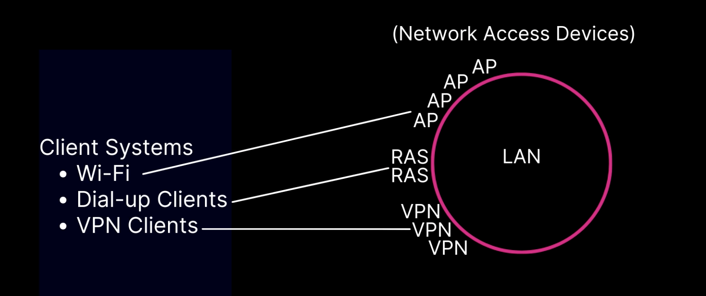
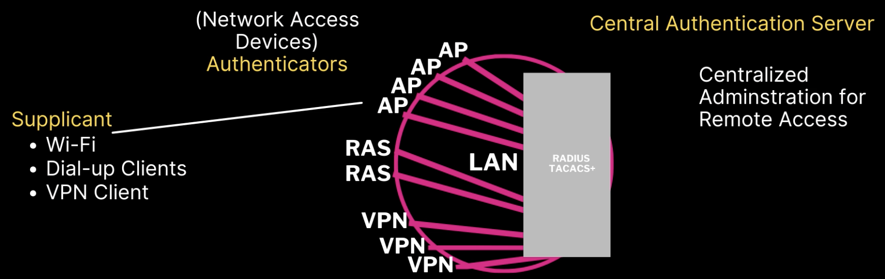

# 4.1 Common Security Techniques

## Baseline Configuration and Deployment

### Definition
- **Baseline Configuration**:  
  A **reference point** or **approved secure setup** for systems and devices. It ensures that all systems start from a **known, hardened state** and helps maintain consistency, compliance, and security across an organization.  

- **Deployment**:  
  The **process of rolling out** systems, software, or devices into production. It applies the baseline configuration and makes systems operational for users while ensuring security measures are in place.  

---

### Key Steps
- **Uninstall or disable unnecessary** devices, services, or protocols  
- **Install patches and updates** to keep systems secure  
- **Configure shared resources, ACLs, and user privileges**  
- **Rename default accounts** (e.g., “admin”)  
- **Change default settings** to reduce vulnerabilities  
- **Install and configure security software**, including:  
  - Anti-malware  
  - Host firewall / Intrusion Detection System (IDS)  

---

### Quick Summary
- **Baseline configuration** = “what the secure system should look like.”  
- **Deployment** = “how we roll it out and enforce the baseline.”  

---

# 4.2 Securing Mobile Devices

## Mobile Device Deployment Models

### 1. Bring Your Own Device (BYOD)
- Employees use **their personal devices** (phones, laptops, tablets) for work.  
- **Pros**: Lower cost for the company, employee convenience.  
- **Cons**: Security risks, lack of full control over the device, potential privacy concerns.  

---

### 2. Corporate Owned, Business Only (COBO)
- Company **purchases and owns** the device.  
- Device is used **exclusively for business purposes**.  
- **Pros**: Maximum control and security, standardized configuration.  
- **Cons**: Less flexibility for employees, higher company cost.  

---

### 3. Corporate Owned, Personally Enabled (COPE)
- Company owns the device but allows **limited personal use**.  
- Balanced approach between **control** and **user flexibility**.  
- **Pros**: Strong security, while still allowing personal convenience.  
- **Cons**: Company still pays for devices, potential mix of personal/work data.  

---

### 4. Choose Your Own Device (CYOD)
- Employees choose from a **pre-approved list of devices**.  
- Company ensures security standards are met.  
- **Pros**: Employee choice + IT control.  
- **Cons**: Company still funds devices, but with limited model flexibility.  

---

### 5. Virtual Desktop Infrastructure (VDI)
- Employees connect to a **virtual environment** hosted by the company.  
- Device itself only acts as an **access terminal**.  
- **Pros**: No sensitive data stored on personal devices, high security.  
- **Cons**: Requires strong network connection, high infrastructure cost.  

---

## Quick Comparison

| Model | Who Owns Device | Usage | Control | Security |
|-------|-----------------|-------|---------|----------|
| **BYOD** | Employee | Work + Personal | Low | Lowest |
| **COBO** | Company  | Business Only   | High | Highest |
| **COPE** | Company  | Business + Some Personal | High | High |
| **CYOD** | Company (employee picks model) | Work + Personal | Medium | Medium |
| **VDI**  | Either (focus on virtual access) | Virtual work only | Very High | Very High |

---

## Mobile Device Management (MDM)
- Software that applies **security policies** to mobile devices used in an enterprise.  
- Can be specific to **iOS/Android** or multi-vendor.  
- Often part of **Enterprise Mobility Management (EMM)** platforms.  
- Functions:  
  - Enroll devices into the corporate network.  
  - Control or restrict device functions (camera, Bluetooth, etc.).  
  - Push/install corporate apps and updates.  
  - Monitor device compliance.  

---

## iOS in the Enterprise
- Managed using **Apple MDM framework**.  
- Supports features like:  
  - Enforcing passcodes, screen locks.  
  - Controlling app installations.  
  - Secure container for separating **corporate vs personal data**.  

---

## Android in the Enterprise
- Managed using **Android Enterprise** or vendor-specific solutions (Samsung Knox, etc.).  
- Supports:  
  - Work profiles (separating work and personal apps).  
  - Control of app installations.  
  - Remote wipe and encryption.  

---

## Cellular and Wi-Fi Connection Methods
- **Cellular Risks**:  
  - Attacks on authentication and confidentiality (e.g., fake base stations).  
- **Wi-Fi Risks**:  
  - Open access points are insecure.  
  - Rogue access points can impersonate trusted networks and steal credentials.  

---

## Personal Area Network (PAN) Technologies
- **Bluetooth**: Used for headphones, car connections, IoT devices. Vulnerable to attacks like Bluejacking, Bluesnarfing.  
- **ANT/ANT+**: Low-power wireless protocols used in health monitors, fitness trackers.  
- **Z-Wave**: Used in smart home devices like personal assistants and IoT sensors.  
- **Wi-Fi Direct**: Device-to-device Wi-Fi connection (no router).  
- **Tethering**: Sharing a phone’s Internet with other devices. Risk: could expose corporate data over insecure connections.  
- **Infrared (IR)**: Short-range, line-of-sight communication (remote controls, sensors).  

---

## NFC and Mobile Payment Services
- **Near Field Communication (NFC)** enables close-range communication (few centimeters).  
- Common use: **mobile wallet apps**.  
  - Apple Pay, Google Pay, Samsung Pay.  
- **Authentication methods**: biometrics (fingerprint, FaceID), PIN.  
- **Potential NFC Exploits**:  
  - **Eavesdropping/skimming**: capturing payment data.  
  - **DoS**: preventing NFC services from functioning.  

---

## Mobile Access Control Systems
- **Screen lock**: first defense (time-based auto-lock).  
- **Password/PIN**: numeric or alphanumeric entry.  
- **Swipe pattern**: common in Android (weaker than PIN).  
- **Biometric**: fingerprint, facial recognition, iris scan.  
- **Lockout**: device blocks access after failed attempts.  
- **Context-based authentication**: adaptive security (e.g., require stronger auth if logging in from new location or untrusted Wi-Fi).  

---

## Remote Wipe
- Also called **“kill switch”**.  
- Restores device to factory defaults or clears storage (entirely or partially).  
- Initiated from enterprise management software (MDM/EMM).  
- Risk: if device is offline or blocked, wipe may not execute.  

---

## Full Device Encryption and External Media
- **iOS Device Encryption**: built-in, includes data protection and secure erase.  
- **Android Device Encryption**: newer versions enable full-disk encryption by default.  
- **External Media**: USB drives, SD cards must also be encrypted to protect sensitive data.  

---

## Guidelines for Implementing Mobile Device Security
- Be aware of **connection methods** (cellular, Wi-Fi, Bluetooth, NFC).  
- Understand the **level of control** for each connection method.  
- Use an **MDM/EMM platform** to enforce policies.  
- Apply **security controls** on all corporate devices.  
- Monitor and restrict **third-party app installations**.  
- Prevent **rooting, jailbreaking, carrier unlocking** (weakens device security).  
- Enforce policies to disable risky features (e.g., USB debugging).  
- Plan secure **deployment models** (BYOD, COBO, COPE, CYOD, VDI).  
- Recognize inherent risks with **BYOD** and mitigate with security policies.  
- Apply multiple security controls to **balance usability and protection**.  

---

## Quick Summary Table

| Feature / Method          | Purpose | Security Risks | Mitigation |
|----------------------------|---------|----------------|------------|
| **MDM/EMM**               | Centralized management of devices | Bypass by user, limited support on old devices | Use enforced enrollment, strong policies |
| **Cellular/Wi-Fi**        | Connectivity | Rogue APs, fake base stations | VPN, WPA3, disable auto-connect |
| **PAN (Bluetooth, etc.)** | Short-range communication | Bluejacking, Bluesnarfing | Disable when not needed, patch devices |
| **NFC / Mobile Payments** | Mobile transactions | Skimming, DoS | Tokenization, biometric auth |
| **Access Control**        | Device authentication | Weak PINs, stolen device | Strong PIN, biometrics, lockout |
| **Remote Wipe**           | Erase lost/stolen devices | Device offline | Auto-wipe after failed logins |
| **Full Encryption**       | Protect stored data | None if disabled | Enable by default, encrypt SD cards |

---

# 4.3 Embedded Systems

## Embedded Systems
- **Definition**: A computer system with a **dedicated function** (unlike general-purpose computers).  
- Characteristics:  
  - Static environments (rarely updated).  
  - Can be small (smart sensor) or complex (vehicle systems).  
  - Depend on **vendor support** for security patches and updates.  
  - Often run firmware on **programmable logic controllers (PLCs)**.  

⚠️ **Security concern**: Many embedded systems are not patched regularly → vulnerable to attacks.

---

## SCADA and HVAC Control
- **SCADA (Supervisory Control and Data Acquisition)**  
  - Used to monitor/manage **industrial, infrastructure, and facility-based processes**.  
  - Runs on PCs but controls **plant devices and field devices**.  
  - Security issues can impact critical infrastructure.  

- **ICS (Industrial Control Systems)**  
  - Broader category that includes SCADA.  
  - Controls industrial processes like power plants, manufacturing, pipelines.  

- **HVAC (Heating, Ventilation, Air Conditioning)**  
  - Integrated into building automation.  
  - Can be exploited as an entry point for malware.  
  - Example: **Stuxnet** targeted ICS/SCADA systems.  

---

## Medical Devices
- Found in hospitals, clinics, and home environments.  
- Often run on **unsecure protocols and control systems**.  
- Risks:  
  - Attackers can pivot into networks storing **Protected Health Information (PHI)**.  
  - Ransomware: attackers disrupt services until ransom is paid.  
  - Safety risks: tampering with **dosage levels or device settings** can cause injury/death.  

⚠️ Security+ takeaway: Medical devices are **life-critical** → confidentiality + safety risks.

---

## In-Vehicle Computing Systems and Drones

### In-Vehicle Computing
- Includes computer-assisted systems:  
  - Engine, steering, brakes.  
  - Entertainment and navigation systems.  
  - Event data recorders (“black box”).  
- Risks: Remote exploitation could endanger safety.  

### UAVs (Unmanned Aerial Vehicles)
- Examples: fixed-wing aircraft, multi-rotor drones.  
- Risks:  
  - **Insecure communication channels**.  
  - Can be used for **surveillance or malicious attacks**.  

---

## Smart Devices and IoT (Internet of Things)
- **Smart Devices**: appliances with processing, storage, and networking (e.g., smart TVs, thermostats).  
- **Home Automation**:  
  - Central hubs controlling lighting, locks, alarms, cameras.  
  - Require secure patch policies.  
- **Wearable Technology**: smart watches, fitness trackers → collect sensitive personal data.  
- **Smart Camera Systems**: often exposed to the Internet with weak passwords.  

⚠️ Security+ takeaway: IoT = high risk because of **default passwords, weak updates, always-on connectivity**.  

---

## Security for Embedded Systems
### Key Controls:
1. **Network Segmentation**  
   - Place embedded/IoT devices in **isolated VLANs** to limit lateral movement.  

2. **Application Firewalls**  
   - Protect applications communicating with embedded systems.  

3. **Wrappers (Host-based Firewalls)**  
   - Provide additional filtering/protection for devices lacking native defenses.  

4. **Firmware Version Control & Updates**  
   - Keep firmware patched and up to date.  
   - Apply vendor security updates promptly.  

---

## Exam Tips (Security+ Focus)
- **Embedded systems** = specialized devices with limited update capability → often vulnerable.  
- **SCADA/ICS** = high-value targets; attacks can disrupt **critical infrastructure**.  
- **Medical devices** = safety + data confidentiality (PHI).  
- **In-vehicle systems/drones** = safety-critical; insecure communication is a major risk.  
- **IoT/Smart devices** = often default credentials, poor vendor patching → require **network segmentation + strong authentication**.  
- **Mitigation** = segmentation, firewalls, firmware updates, vendor management.  

---
# 4.4 Wireless Security

## 🔹 Installation Considerations
When setting up wireless networks, proper planning improves performance and reduces security risks.

- **Site Surveys**  
  Assess the physical environment to determine the best placement for wireless access points (WAPs). Helps avoid dead zones and interference.

- **Heat Maps (Coverage Maps)**  
  Visual maps showing wireless signal strength across an area. Useful for spotting weak coverage areas.

- **WiFi Analyzers**  
  Tools that measure signal strength, interference, and channel usage. Help optimize performance and security.

- **Channel Overlaps**  
  Occur when nearby wireless networks use the same or overlapping frequencies (e.g., 2.4 GHz channels). Can cause interference and degraded performance.

- **Wireless Access Point (WAP) Placement**  
  Proper placement ensures good coverage while minimizing signal leakage outside secure areas (reducing risk of external attacks).

---

## 🔹 Wireless Security Problems

- **Unauthorized Access**  
  Attackers connect to a wireless network without permission, often exploiting weak or default passwords.

- **Sniffing**  
  Capturing and analyzing wireless traffic. If unencrypted, attackers can steal credentials or sensitive data.

- **War Driving**  
  Driving around with a laptop/antenna to discover and map unsecured or poorly secured wireless networks.

- **Unauthorized Access Points & Evil Twins (Man-in-the-Middle)**  
  - **Unauthorized Access Point (Rogue AP):** An attacker sets up a wireless AP on the network without authorization.  
  - **Evil Twin:** A fake AP that mimics a legitimate one. Users unknowingly connect, allowing attackers to intercept traffic (MITM attack).

- **Wi-Fi Protected Setup (WPS) Vulnerability**  
  - WPS is a feature meant to simplify connecting devices with a PIN or button.  
  - Vulnerable to brute-force attacks against the WPS PIN.  
  - Best practice: disable WPS.

---

✅ **Summary:**  
Wireless networks require careful planning (site surveys, heat maps, analyzer tools) and strong protections. Security threats like sniffing, war driving, and evil twin attacks make **encryption (WPA3), strong authentication, and disabling insecure features (like WPS)** essential.

---

# 4.5 Wireless Configuration

## 🔹 Antenna Types
- **Omnidirectional Antenna**  
  - Radiation power distributed equally in all directions (horizontal plane).  
  - Example: Wi-Fi access point antennas.  
  - Pros: Covers a wide area.  
  - Cons: Easier for attackers to detect signals outside secure areas.

- **Directional Antenna (e.g., Yagi Antenna)**  
  - Radiation power concentrated in one specific direction.  
  - Pros: Stronger signal in target direction, longer range.  
  - Cons: Limited coverage angle.

---

## 🔹 Wireless Security: Encryption

### WEP (Wired Equivalent Privacy)
- Uses **RC4 stream cipher** (weak).  
- Issues:  
  - Easily crackable.  
  - Only option for old **802.11b** networks.  
  - **Static keys** (don’t change).  
- Encryption strength:  
  - Low: 64-bit key.  
  - High: 128-bit key.  
- Uses an **Initialization Vector (IV)**, but it’s too short and predictable.  
- ⚠️ Considered insecure and deprecated.

---

### WPA (Wi-Fi Protected Access)
- Introduced **TKIP (Temporal Key Integrity Protocol)** with **dynamic keys**.  
- Still relied on **RC4**.  
- Used longer initialization vector than WEP.  
- Transitional step—no longer secure today.

---

### WPA2
- Replaced RC4 with **AES (block cipher)**.  
- Uses **CCMP (Counter Mode with Cipher Block Chaining Message Authentication Protocol)**.  
- Provides strong encryption + integrity.  
- **Not backwards compatible** with WEP/WPA (different ciphers).  
- Still widely in use, but vulnerable to some brute-force/side-channel attacks.

---

### WPA3
- Uses **Dragonfly handshake (SAE – Simultaneous Authentication of Equals)**.  
- Protects against offline password cracking.  
- Uses **Galois Counter Mode (GCM)** for integrity checking.  
- Stronger security, mandatory in modern devices.

---

## 🔹 Authentication

### Decentralized Authentication
- Client authenticates **directly** with AP/VPN/RAS.  
- Each access device manages its own credentials.  
- Simple, but not scalable.  
- Example: **WPA2-Personal (PSK)** at home Wi-Fi.

### Centralized Authentication (Enterprise)
- Based on **802.1X** standard.  
- Roles:  
  - **Supplicant** → client device (Wi-Fi laptop, VPN client).  
  - **Authenticator** → AP, VPN gateway, or RAS.  
  - **Authentication Server** → RADIUS/TACACS+.  
- Process:  
  1. Supplicant requests access.  
  2. Authenticator forwards credentials.  
  3. Server validates (e.g., via Active Directory).  
  4. Access granted/denied.
  
     
- Protocol: **EAPoL (Extensible Authentication Protocol over LAN)**.  
- Example: **WPA2/WPA3-Enterprise** in corporate Wi-Fi.

### Comparison Table

| Feature            | Decentralized (PSK)            | Centralized (802.1X)                 |
|--------------------|--------------------------------|---------------------------------------|
| Who validates?     | Access Point itself            | Central server (RADIUS/TACACS+)       |
| Credential type    | Shared Wi-Fi password (PSK)    | Individual user credentials           |
| Scalability        | Poor (hard to manage many APs) | High (central policy control)         |
| Security level     | Weaker                         | Stronger, enterprise-grade            |
| Example use case   | Home Wi-Fi                     | Corporate Wi-Fi with AD integration   |

📌 **Key takeaway for Security+**:  
- **Decentralized = WPA2-Personal (PSK)**.  
- **Centralized = WPA2/WPA3-Enterprise with RADIUS**.  

---

## 🔹 Bluetooth Security
- **Bluetooth = Personal Area Network (PAN)** protocol (short range, cable replacement).  

### Modes
- **Discovery Mode** → device visible to others.  
- **Automatic Pairing** → convenience, but risk if insecure.

### Threats
- **Bluejacking**: Sending spam messages to nearby devices.  
- **Bluesnarfing**: Stealing information (contacts, files) from a device.  
- **Bluebugging**: More severe → attacker gains full control of the phone:  
  - Make calls.  
  - Send texts.  
  - Eavesdrop on conversations.  

---

✅ **Summary:**  
- Use **WPA3** wherever possible.  
- Avoid WEP/WPA.  
- For enterprise, implement **802.1X with RADIUS**.  
- Secure Bluetooth by turning off discoverability and disabling when not in use.

---

# 4.6 Proper Hardware, Software, and Data Asset Management

## Acquisition/Procurement of a System
- **Acquisition/procurement process**: Steps to evaluate, purchase, or develop a system.
- **Assignment/accounting**: Tracking system usage and financial accountability.
- **Ownership**: Clearly define who is responsible for the system.
- **Classification**: Labeling assets based on sensitivity (e.g., public, internal, confidential).
- **Monitoring/asset tracking**: Continuously track where systems and devices are located.
- **Inventory**: Maintain a complete list of assets.
- **Enumeration**: Numbering/recording assets for easier tracking.
- **Disposal/decommissioning**: Secure removal when assets are no longer used.
- **Sanitization**: Removing sensitive data before re-use or disposal.
- **Destruction**: Physical destruction of media or devices to prevent data recovery.
- **Certification**: Verification that systems meet requirements before use.
- **Data retention**: Defining how long data must be stored (for legal, compliance, or business needs).

---

## Acquisition or Development of a System: Feasibility Study
Factors to decide whether to **develop** or **acquire** a system:
- **Functionality**: Does the system meet required business needs?
- **Cost**: Compare cost of building vs. buying.
- **Resources**: Staff, hardware, and time needed for development.
- **Compatibility**: Must align with business plans, IT infrastructure, and risk appetite.

---

## Requirements Definition
Clearly define:
- What the system should do.
- How users will interact with it.
- Conditions under which the system must operate.
- Information criteria the system should meet.

**Example activities:**
- Identify and consult stakeholders.
- Identify relevant data privacy and governance requirements.
- Analyze requirements to detect/correct conflicts and set priorities.
- Define system boundaries.
- Identify security requirements.

---

## System Acquisition and Design
- **Software selection and acquisition**
  - Consider risks/benefits of developing in-house vs. buying a complete/tested system.
  - Decision depends on cost, availability, and time-to-deploy.
- **Design**
  - Develop a detailed design based on requirements.
  - Illustrate how data flows through the system (inputs, outputs, processing).
  - Develop test plans.

---

## Configuration or Development
- **Configuration (purchased system)**
  - Define, track, and control changes in the acquired system.
  - Integrate ERP or other systems into existing IT infrastructure.
  - Use change management policies (roles, impact assessment, approvals).

- **Development (in-house)**
  - Follow detailed design from earlier phase.
  - Activities include:
    - Coding and debugging.
    - Ensuring security by design (security is built in, not added later).
    - Converting data from old system to new system.

---

## Final Testing, Certification, and Implementation
- Perform **system testing** to ensure requirements are met.
- Certification confirms system is secure and functional.
- Implementation puts the system into production use.

---

## Post-Implementation Review
- Review performance, security, and compliance after deployment.
- Identify lessons learned for future projects.

---

## Decommissioning Systems
- When systems are retired, ensure:
  - Data is securely removed (sanitization or destruction).
  - Documentation of the retirement process.
  - No sensitive data remains accessible.

---

# 4.7 Vulnerability Assessments

## What are Vulnerabilities?
- Areas where an organization is **not fully protected** and can be exploited by attackers.
- Security+ expects you to know **types, methods, and tools** used to identify vulnerabilities.

---

## Examples of Vulnerabilities
- **Untrained staff** clicking on phishing links.  
- **Open network ports** in common areas that are live but not secured.  
- **No alarm system** to detect intrusions.  
- **Servers and critical systems** without access controls.  
- **Laptops with VPN access/sensitive data** not encrypted.  
- **Outdated/unsupported software** (legacy devices).  

*(Explanation: These are common weak spots that attackers exploit. Many map directly to Security+ test questions.)*

---

## Vulnerability Analysis Approaches
- **Static analysis**: Manually reviewing source code or using tools to detect coding errors.  
- **Dynamic analysis**: Evaluating software/system while it is running.  
- **Side-channel analysis**: Observing system behavior/data flows (e.g., sniffers).  
- **Reverse engineering**: Deconstructing software/hardware to see how it works.  

---

## Vulnerability Analysis Methods
- **Wireless vulnerability scan**: Identify signal coverage, configs, and weaknesses (e.g., Reaver, KRACK).  
- **Software composition analysis**: Check source code for open-source components with known flaws.  
- **Fuzzing**: Inject malformed data to test how an app handles unexpected input.  
- **Pivoting**: Using a compromised system to target others in the same network.  
- **Post-exploitation**: Actions after initial compromise to maintain access.  
- **Persistence**: Attacker’s ability to stay hidden and maintain control.  

---

## Vulnerability Analysis Tools
- **Protocol analyzer**: Captures network traffic (e.g., Wireshark).  
- **Network traffic analyzer**: Similar but sensor-based (e.g., Zeek).  
- **Port scanner**: Finds open ports and services (e.g., Nmap).  
- **HTTP interceptor**: Inspects/modifies HTTP(S) traffic (e.g., Burp Suite).  
- **SCAP scanner**: Uses SCAP to scan devices against baselines (e.g., DoD SCAP Scanner).  
- **Vulnerability scanner**: Finds known vulnerabilities, config issues, weak defaults (e.g., Nessus).  
- **Exploit framework**: Pre-built attack tools (e.g., Metasploit, PowerShell Empire).  
- **Password cracker**: Tests password strength (e.g., John the Ripper, Hashcat).  

---

## Dependency Management
- Keep track of all **software libraries and dependencies** since outdated ones may contain vulnerabilities.

---

## Vulnerability Analysis Dependencies
- **Permissions and access**: Testers may need ID badges, background checks, etc.  
- **Facility considerations**: Onsite escorting, restricted access, clearance requirements.  
- **Physical security**: Protects testers and data during assessment.  
- **Reason for corrections/changes**: Assessments should tie findings to business/IT needs.  

---
