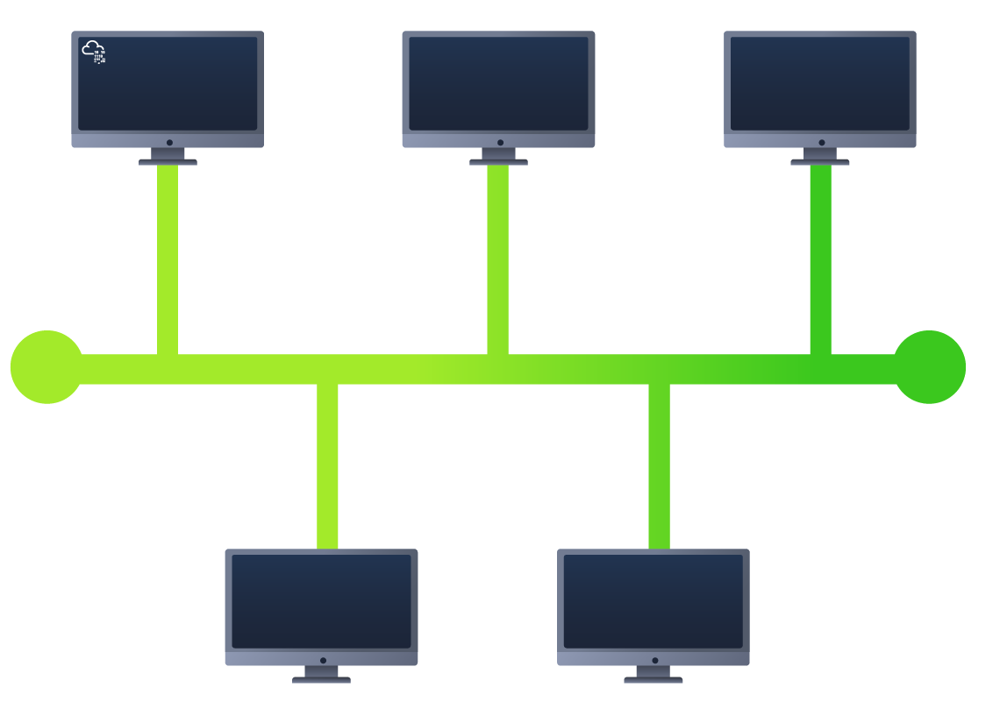
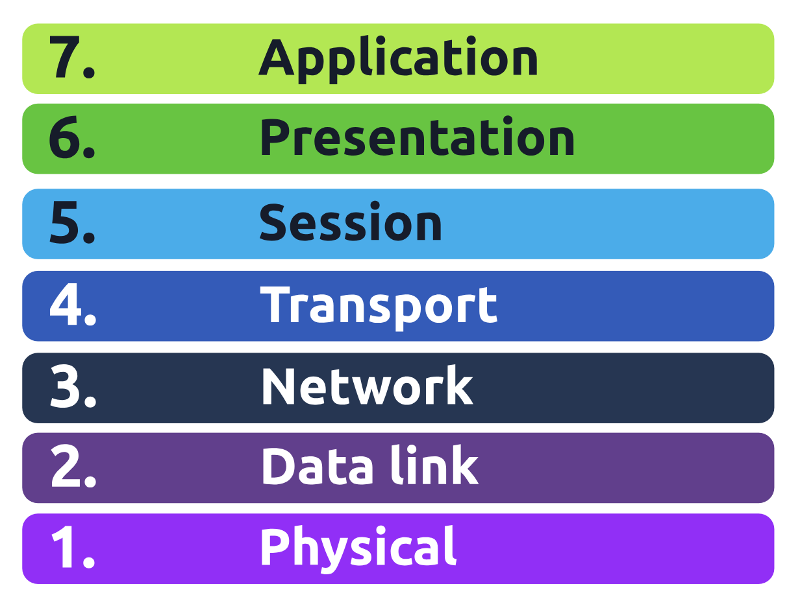
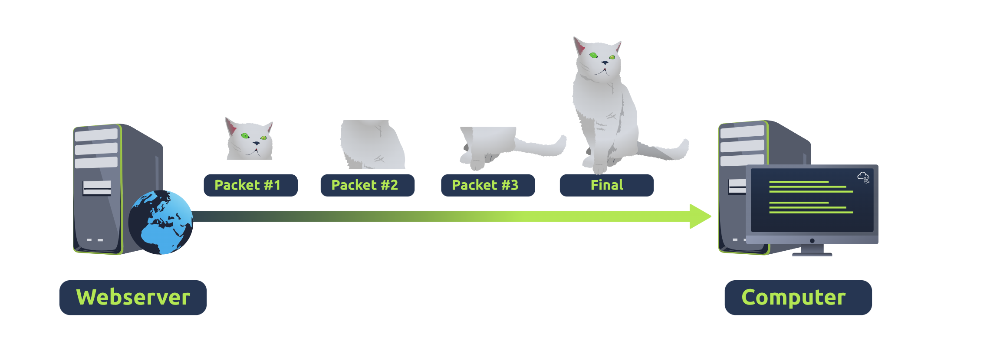
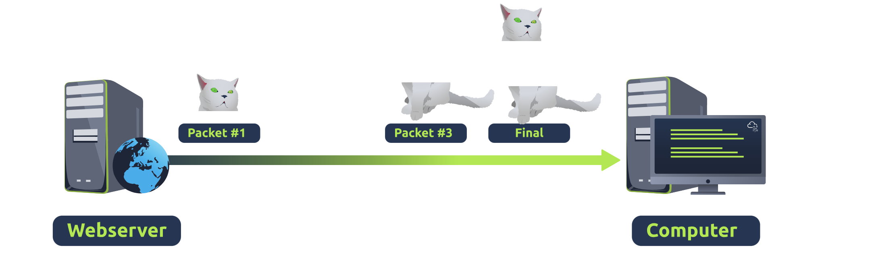

# Networking Fundamentals

## 1.What is a Network?
- A network is simply **things connected**.  
- Example: your friendship circle, connected through shared interests, hobbies, or skills.  

### Examples of Networks in Daily Life
- A city’s public transportation system  
- National power grid for electricity  
- Meeting and greeting neighbors  
- Postal systems for letters and parcels  

### Networks in Computing
- Same principle, but applied to **technological devices**.  
- Example: your phone connects to access services.  
- Networks can range from **2 devices to billions** (e.g., laptops, phones, cameras, traffic lights, IoT devices).  
- Integrated into daily life: weather data, electricity delivery, traffic management, etc.  

---

## Networking Example
- **Alice, Bob, and Jim** form a simple network (connected to exchange data).  
- Networks come in all shapes and sizes.  

---

## The Internet
- The Internet is one giant network made up of many smaller networks.  
- Example: Alice introduces new friends (Zayn, Toby) to Bob and Jim.  
  - Alice acts as a **messenger** since she “speaks the same language.”  

### History
- First iteration: **ARPANET (1960s)**, funded by the US Defense Department.  
- Modern Internet began in **1989**, created by **Tim Berners-Lee** with the invention of the **World Wide Web (WWW)**.  

### Structure
- Many **private networks** connected together.  
- When private networks connect → form **public networks** (the Internet).
## Private Network vs Public Network vs Internet

| Feature              | Private Network                 | Public Network                  | Internet (Global Network) |
|-----------------------|---------------------------------|---------------------------------|----------------------------|
| **Access**           | Restricted (home, company)      | Open to anyone nearby           | Open to all (global)      |
| **Security**         | More secure, controlled access  | Less secure, potential risks    | Varies (depends on endpoint security) |
| **IP Addresses**     | Private IP ranges (RFC 1918)    | Public IPs assigned by ISP      | Public IPs (globally unique) |
| **Examples**         | Home Wi-Fi, LAN, intranet       | Coffee shop Wi-Fi, hotel Wi-Fi  | Websites, cloud, global apps |


---

## Identifying Devices on a Network
Similar to humans having **names** and **fingerprints**, devices also have two identifiers:
1. **IP Address** – can change, but identifies devices within a network.  
2. **MAC Address** – fixed (like a fingerprint/serial number).  

---

## IP Addresses
- IP = Internet Protocol address.  
- Used to identify a device on a network.  
- Format: **four octets (0–255)** separated by dots.  
  - Example: `192.168.1.1`  

### Characteristics
- IP addresses can change.  
- Each device must have a **unique IP** within the same network.  
- Governed by **protocols** (rules of communication).  

### Types of IP Addresses
- **Private IP**: used within a local/private network.  
- **Public IP**: used to identify a device on the Internet (assigned by ISP).  

#### Example
| Device Name       | IP Address    | Type    |
|-------------------|--------------|---------|
| DESKTOP-KJE57FD   | 192.168.1.77 | Private |
| DESKTOP-KJE57FD   | 86.157.52.21 | Public  |
| CMNatic-PC        | 192.168.1.74 | Private |
| CMNatic-PC        | 86.157.52.21 | Public  |

- Private IPs allow internal communication.  
- Public IP (from ISP) is shared when accessing the Internet.  

---

## IPv4 vs IPv6
- **IPv4**:  
  - 2^32 = ~4.29 billion addresses.  
  - Running out due to billions of devices.  

- **IPv6**:  
  - 2^128 = ~340 trillion-plus addresses.  
  - Solves IPv4 exhaustion.  
  - More efficient addressing methodologies.  

---

## MAC Addresses
- **MAC (Media Access Control)** = permanent unique identifier for a network interface.  
- Format: **12-character hexadecimal**, split into pairs, separated by colons.  
  - Example: `a4:c3:f0:85:ac:2d`  

### Structure
- First 6 hex digits = **vendor/manufacturer**.  
- Last 6 hex digits = **unique identifier** for the device.  

---

## MAC Spoofing
- MAC addresses can be **faked/spoofed**.  
- Spoofing = device pretends to use another device’s MAC address.  
- Can bypass weak security systems (e.g., firewalls configured to trust certain MACs).  

### Real-world Use
- Public places (cafes, hotels, coffee shops) often use **MAC-based access control** for guest Wi-Fi.  
- Example: pay-per-device Wi-Fi → can be bypassed with spoofing.
---

## What is Ping?
- **Ping** is a fundamental network tool.  
- Uses **ICMP (Internet Control Message Protocol)** packets.  
- Purpose:  
  - Check if a device/host is reachable.  
  - Measure performance (latency, reliability).  

---

### How Ping Works
1. Ping sends an **ICMP Echo Request** to the target.  
2. The target replies with an **ICMP Echo Reply**.  
3. The time between request and reply is measured.  

---

### Ping Syntax
`ping [IP address or website URL]`

- Example:  
  `ping 192.168.1.254`
  
---

## 2 Intro to LAN

## LAN Topologies
A **topology** is the design or structure of how devices are connected in a network.  

### Star Topology
- Devices connect to a **central device** (switch/hub).  
- **Advantages**:  
  - Reliable, scalable (easy to add devices).  
  - Centralized management.  
- **Disadvantages**:  
  - Higher cost (more cabling + equipment).  
  - Central device is a **single point of failure**.
  ```mermaid
  graph TD
    A[Switch/Hub] --> B[PC1]
    A --> C[PC2]
    A --> D[PC3]
    A --> E[PC4]

---

### Bus Topology
- All devices share a **single backbone cable**.  
- **Advantages**:  
  - Simple and cost-effective.  
- **Disadvantages**:  
  - Bottlenecks due to shared medium.  
  - Troubleshooting is difficult.  
  - **Single point of failure** = if cable breaks, entire network fails.



---

### Ring Topology
- Devices form a **loop**, each forwarding data to the next until it reaches destination.  
- **Advantages**:  
  - Less prone to bottlenecks than bus.  
  - Easy fault isolation.  
- **Disadvantages**:  
  - Inefficient (data may pass through many devices).  
  - Failure of one cable/device can break the entire ring.


---

## Switches
- A **switch** connects multiple devices in a network (computers, printers, etc.) via **ports**.  
- More efficient than **hubs/repeaters**:  
  - Sends data only to the **intended target** (not all devices).  
  - Reduces network traffic.  
- Found in larger networks (businesses, schools).  
- Support many ports (4, 8, 16, 24, 32, 64).  

---

## Routers
- A **router** connects **different networks** together (e.g., LAN → Internet).  
- Uses **routing tables** to determine best path for data delivery.  
- Enables communication between networks.  
- Provides **path redundancy** (multiple routes possible).  

---

## Quick Comparison Table

| Topology  | Main Feature                  | Advantage                  | Disadvantage                   |
|-----------|-------------------------------|----------------------------|--------------------------------|
| Star      | Central device (switch/hub)  | Reliable, scalable         | Central device failure = outage |
| Bus       | Single backbone cable        | Simple, cheap              | Bottlenecks, single point of failure |
| Ring      | Devices in loop              | Less bottleneck than bus   | One failure breaks whole ring  |

---
# Subnetting Notes

## What is Subnetting?
- Subnetting = dividing a larger network into smaller, manageable subnetworks.  
- Think of it as **slicing a cake** → each slice = subnet.  
- Helps assign network portions to specific groups (e.g., Accounting, Finance, HR).

---

## Purpose of Subnetting
- Organize and control network traffic  
- Improve efficiency and security  
- Provide full control over IP address usage  

---

## IP Address Structure
- IPv4 address = **32 bits** (4 octets, 0–255 each)  
- Subnet mask also uses 32 bits  

Example: `192.168.1.1`

- Octet 1 = 192  
- Octet 2 = 168  
- Octet 3 = 1  
- Octet 4 = 1  

---

## Subnet Address Types

| **Type**           | **Purpose**                                                                 | **Explanation**                                                                                      | **Example**      |
|---------------------|-----------------------------------------------------------------------------|------------------------------------------------------------------------------------------------------|------------------|
| **Network Address** | Identifies start of the network. Used to identify network existence.        | A device with IP `192.168.1.100` will be on the network `192.168.1.0`.                               | `192.168.1.0`    |
| **Host Address**    | Identifies individual devices in subnet.                                   | Example: `192.168.1.1` for one host.                                                                 | `192.168.1.100`  |
| **Default Gateway** | Special address that routes traffic to other networks.                     | Usually first (`.1`) or last (`.254`) host address. Sends data outside subnet (e.g., to the Internet). | `192.168.1.254`  |

---

## Benefits of Subnetting
- **Efficiency** → reduces congestion by splitting traffic  
- **Security** → isolates sensitive devices (e.g., HR PCs vs public Wi-Fi)  
- **Full Control** → admins can assign resources to specific groups  

---

## Example Scenarios
### Business with Multiple Departments
- **Accounting subnet**  
- **Finance subnet**  
- **Human Resources subnet**


### Café Example
1. Subnet 1: Employees, cash registers, internal systems  
2. Subnet 2: Public Wi-Fi hotspot  

➡️ Separation prevents public users from accessing sensitive business devices  

---

# Address Resolution Protocol (ARP)

## What is ARP?
- ARP = Address Resolution Protocol  
- Used to map **IP addresses** (logical identifier) to **MAC addresses** (physical identifier).  
- Each device keeps a log of MAC addresses associated with IP addresses (ARP cache).  
- Enables devices to find each other on the same network.  

---

## How Does ARP Work?
1. **ARP Request**  
   - Device sends a broadcast: *"Who has this IP address?"*  
   - All devices on the network see the request.  

2. **ARP Reply**  
   - The device that owns the IP responds with its **MAC address**.  
   - The requesting device stores the mapping in its **ARP cache** for future use.  

---

## Example
- Device A wants to send data to `192.168.1.10`  
- Device A doesn’t know the MAC


---

# DHCP (Dynamic Host Configuration Protocol)

## What is DHCP?
- A network protocol that **automatically assigns IP addresses** and other network configuration details (subnet mask, gateway, DNS) to devices.  
- Saves time and reduces errors compared to manual IP assignment.  

---

## How DHCP Works (DORA Process)
1. **DHCP Discover**  
   - Device broadcasts a request to find a DHCP server.  

2. **DHCP Offer**  
   - DHCP server responds with an available IP address.  

3. **DHCP Request**  
   - Device replies, asking to use the offered IP.  

4. **DHCP ACK**  
   - DHCP server confirms and finalizes the lease of the IP address.  

---

## Benefits
- **Automatic** → No need for manual IP assignment.  
- **Efficient** → Reduces human errors and IP conflicts.  
- **Scalable** → Works well for networks with many devices.  

---

✅ **Summary:** DHCP is the protocol that automates IP address assignment using the **DORA process (Discover, Offer, Request, ACK)**.


---


# 3 OSI Model (Open Systems Interconnection)
## Overview
- Framework for how networked devices **send, receive, and interpret data**.  
- Provides **7 layers** (from **Layer 7 → Layer 1**) with specific responsibilities.  
- Ensures interoperability between devices from different vendors.  
- Process of data handling is called **encapsulation** (data gets headers/trailers at each layer).  


---

## OSI Layers

### 1. **Physical Layer** (Layer 1)
- Concerned with **hardware and signals**.  
- Transmits raw bits (`1`s and `0`s) using electrical, light, or radio signals.  
- Examples: Ethernet cables, fiber optics, Wi-Fi radio waves.  

---

### 2. **Data Link Layer** (Layer 2)
- Responsible for **physical addressing** and reliable link-to-link delivery.  
- Uses **MAC addresses** (burned into NICs) to identify devices.  
- Tasks:
  - Add destination/source MAC to frames.  
  - Ensure data is formatted for transmission.  
- Devices: Switches, NICs.  
- **Vulnerable to MAC spoofing**.  

---

### 3. **Network Layer** (Layer 3)
- Handles **routing** and **logical addressing (IP addresses)**.  
- Determines **best path** for packets.  
- Protocols:  
  - **OSPF** (Open Shortest Path First)  
  - **RIP** (Routing Information Protocol)  
- Devices: Routers.  
- Key questions answered:  
  - Shortest path?  
  - Most reliable path?  
  - Fastest connection (copper vs fiber)?  

---

### 4. **Transport Layer** (Layer 4)
- Ensures **end-to-end communication**.  
- Protocols: **TCP** and **UDP**.  

**TCP (Transmission Control Protocol)**  
- Reliable, connection-oriented, error-checking.  
- Slower due to overhead.  
- Use cases: Email, file transfer, web browsing.
  

**UDP (User Datagram Protocol)**  
- Faster, connectionless, no guarantee.  
- Unreliable but efficient.  
- Use cases: Streaming, VoIP, ARP, DHCP.  


---

### 5. **Session Layer** (Layer 5)
- Manages and maintains **sessions (connections)** between devices.  
- Responsibilities:  
  - Open/close connections.  
  - Re-establish if lost.  
  - Use **checkpoints** to resume transmission.  
- Unique per communication session.  

---

### 6. **Presentation Layer** (Layer 6)
- Acts as a **translator** between application data and network format.  
- Provides **data formatting, compression, and encryption**.  
- Examples: SSL/TLS encryption, JPEG, MP3.  

---

### 7. **Application Layer** (Layer 7)
- Closest to the **end-user**.  
- Provides **protocols and interfaces** for applications.  
- Examples:  
  - **HTTP/HTTPS** (web browsing)  
  - **DNS** (domain to IP resolution)  
  - **FTP** (file transfer)  
  - **SMTP** (email)  

---

## Key Takeaways
- OSI layers build from **physical transmission** up to **user-facing applications**.  
- Each layer has **distinct tasks**, ensuring modular design.  
- TCP = Reliable, UDP = Fast but unreliable.  
- **MAC = physical address (Layer 2), IP = logical address (Layer 3)**.  

  
