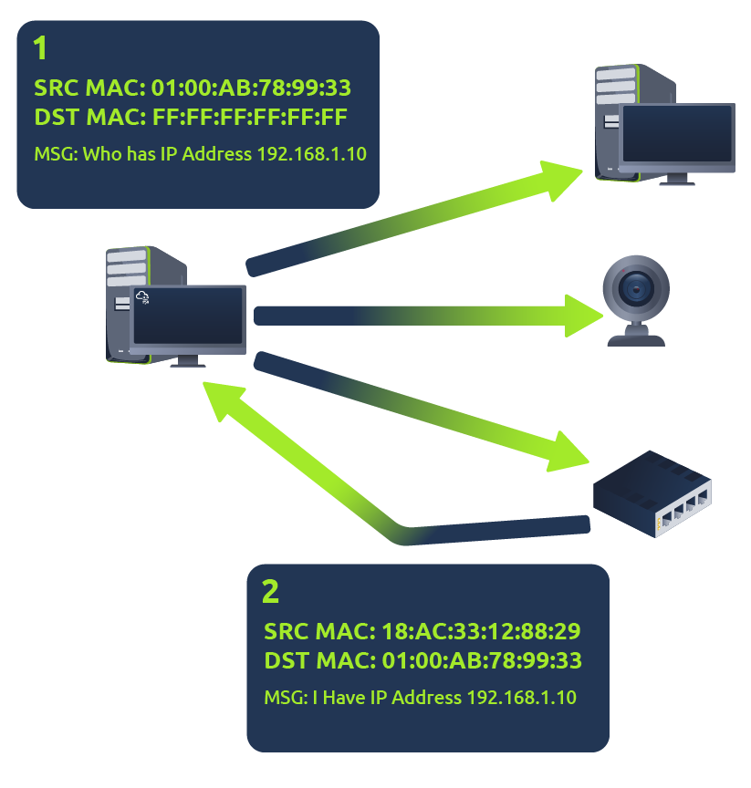
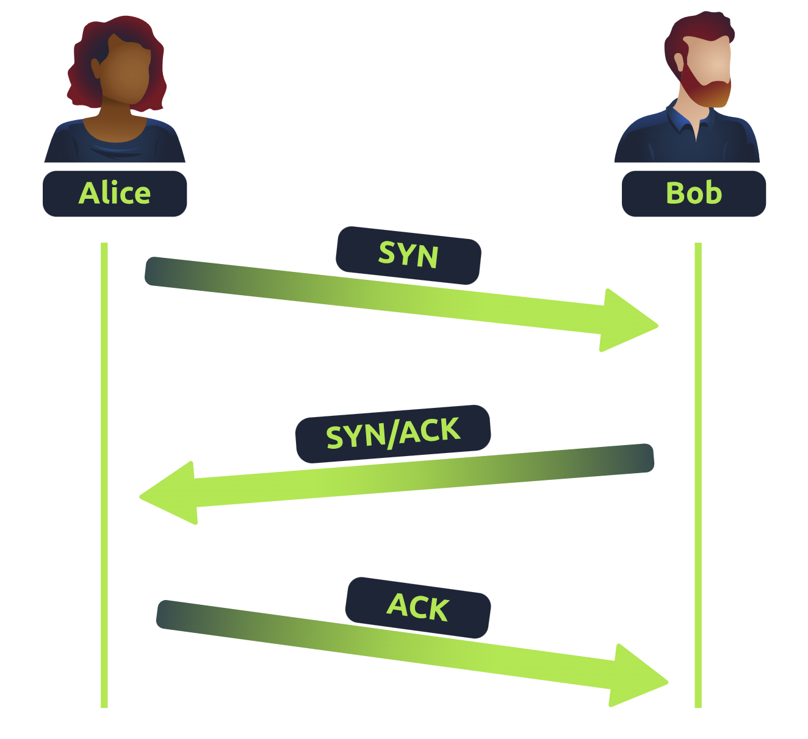
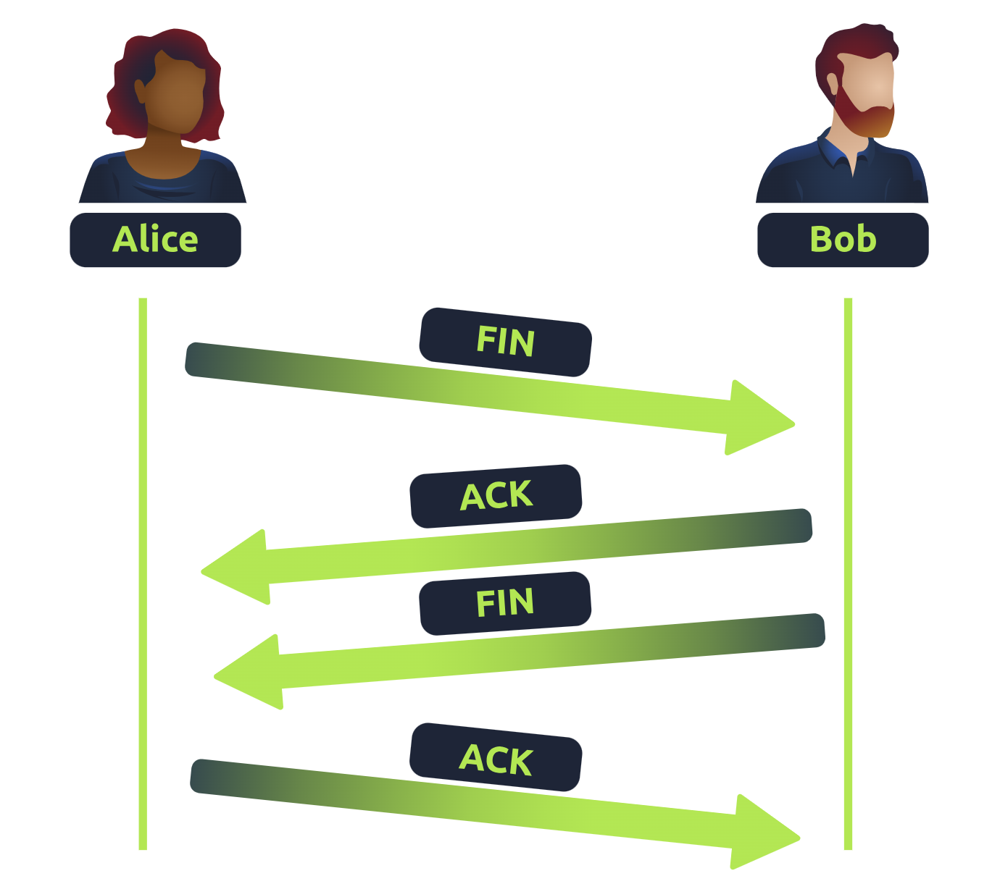
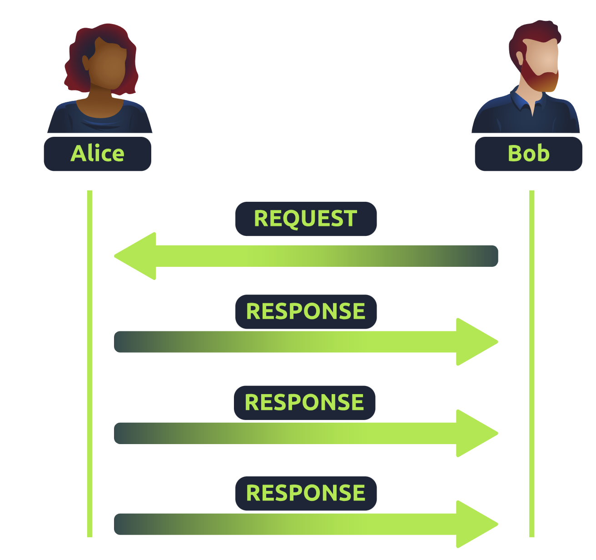

# Networking Fundamentals

## 1.What is a Network?
- A network is simply **things connected**.  
- Example: your friendship circle, connected through shared interests, hobbies, or skills.  

### Examples of Networks in Daily Life
- A city’s public transportation system  
- National power grid for electricity  
- Meeting and greeting neighbors  
- Postal systems for letters and parcels  

### Networks in Computing
- Same principle, but applied to **technological devices**.  
- Example: your phone connects to access services.  
- Networks can range from **2 devices to billions** (e.g., laptops, phones, cameras, traffic lights, IoT devices).  
- Integrated into daily life: weather data, electricity delivery, traffic management, etc.  

---

## Networking Example
- **Alice, Bob, and Jim** form a simple network (connected to exchange data).  
- Networks come in all shapes and sizes.  

---

## The Internet
- The Internet is one giant network made up of many smaller networks.  
- Example: Alice introduces new friends (Zayn, Toby) to Bob and Jim.  
  - Alice acts as a **messenger** since she “speaks the same language.”  

### History
- First iteration: **ARPANET (1960s)**, funded by the US Defense Department.  
- Modern Internet began in **1989**, created by **Tim Berners-Lee** with the invention of the **World Wide Web (WWW)**.  

### Structure
- Many **private networks** connected together.  
- When private networks connect → form **public networks** (the Internet).
## Private Network vs Public Network vs Internet

| Feature              | Private Network                 | Public Network                  | Internet (Global Network) |
|-----------------------|---------------------------------|---------------------------------|----------------------------|
| **Access**           | Restricted (home, company)      | Open to anyone nearby           | Open to all (global)      |
| **Security**         | More secure, controlled access  | Less secure, potential risks    | Varies (depends on endpoint security) |
| **IP Addresses**     | Private IP ranges (RFC 1918)    | Public IPs assigned by ISP      | Public IPs (globally unique) |
| **Examples**         | Home Wi-Fi, LAN, intranet       | Coffee shop Wi-Fi, hotel Wi-Fi  | Websites, cloud, global apps |


---

## Identifying Devices on a Network
Similar to humans having **names** and **fingerprints**, devices also have two identifiers:
1. **IP Address** – can change, but identifies devices within a network.  
2. **MAC Address** – fixed (like a fingerprint/serial number).  

---

## IP Addresses
- IP = Internet Protocol address.  
- Used to identify a device on a network.  
- Format: **four octets (0–255)** separated by dots.  
  - Example: `192.168.1.1`  

### Characteristics
- IP addresses can change.  
- Each device must have a **unique IP** within the same network.  
- Governed by **protocols** (rules of communication).  

### Types of IP Addresses
- **Private IP**: used within a local/private network.  
- **Public IP**: used to identify a device on the Internet (assigned by ISP).  

#### Example
| Device Name       | IP Address    | Type    |
|-------------------|--------------|---------|
| DESKTOP-KJE57FD   | 192.168.1.77 | Private |
| DESKTOP-KJE57FD   | 86.157.52.21 | Public  |
| CMNatic-PC        | 192.168.1.74 | Private |
| CMNatic-PC        | 86.157.52.21 | Public  |

- Private IPs allow internal communication.  
- Public IP (from ISP) is shared when accessing the Internet.  

---

## IPv4 vs IPv6
- **IPv4**:  
  - 2^32 = ~4.29 billion addresses.  
  - Running out due to billions of devices.  

- **IPv6**:  
  - 2^128 = ~340 trillion-plus addresses.  
  - Solves IPv4 exhaustion.  
  - More efficient addressing methodologies.  

---

## MAC Addresses
- **MAC (Media Access Control)** = permanent unique identifier for a network interface.  
- Format: **12-character hexadecimal**, split into pairs, separated by colons.  
  - Example: `a4:c3:f0:85:ac:2d`  

### Structure
- First 6 hex digits = **vendor/manufacturer**.  
- Last 6 hex digits = **unique identifier** for the device.  

---

## MAC Spoofing
- MAC addresses can be **faked/spoofed**.  
- Spoofing = device pretends to use another device’s MAC address.  
- Can bypass weak security systems (e.g., firewalls configured to trust certain MACs).  

### Real-world Use
- Public places (cafes, hotels, coffee shops) often use **MAC-based access control** for guest Wi-Fi.  
- Example: pay-per-device Wi-Fi → can be bypassed with spoofing.
---

## What is Ping?
- **Ping** is a fundamental network tool.  
- Uses **ICMP (Internet Control Message Protocol)** packets.  
- Purpose:  
  - Check if a device/host is reachable.  
  - Measure performance (latency, reliability).  

---

### How Ping Works
1. Ping sends an **ICMP Echo Request** to the target.  
2. The target replies with an **ICMP Echo Reply**.  
3. The time between request and reply is measured.  

---

### Ping Syntax
`ping [IP address or website URL]`

- Example:  
  `ping 192.168.1.254`
  
---

## 2 Intro to LAN

## LAN Topologies
A **topology** is the design or structure of how devices are connected in a network.  

### Star Topology
- Devices connect to a **central device** (switch/hub).  
- **Advantages**:  
  - Reliable, scalable (easy to add devices).  
  - Centralized management.  
- **Disadvantages**:  
  - Higher cost (more cabling + equipment).  
  - Central device is a **single point of failure**.
  ```mermaid
  graph TD
    A[Switch/Hub] --> B[PC1]
    A --> C[PC2]
    A --> D[PC3]
    A --> E[PC4]

---

### Bus Topology
- All devices share a **single backbone cable**.  
- **Advantages**:  
  - Simple and cost-effective.  
- **Disadvantages**:  
  - Bottlenecks due to shared medium.  
  - Troubleshooting is difficult.  
  - **Single point of failure** = if cable breaks, entire network fails.


---

### Ring Topology
- Devices form a **loop**, each forwarding data to the next until it reaches destination.  
- **Advantages**:  
  - Less prone to bottlenecks than bus.  
  - Easy fault isolation.  
- **Disadvantages**:  
  - Inefficient (data may pass through many devices).  
  - Failure of one cable/device can break the entire ring.


---

## Switches
- A **switch** connects multiple devices in a network (computers, printers, etc.) via **ports**.  
- More efficient than **hubs/repeaters**:  
  - Sends data only to the **intended target** (not all devices).  
  - Reduces network traffic.  
- Found in larger networks (businesses, schools).  
- Support many ports (4, 8, 16, 24, 32, 64).  

---

## Routers
- A **router** connects **different networks** together (e.g., LAN → Internet).  
- Uses **routing tables** to determine best path for data delivery.  
- Enables communication between networks.  
- Provides **path redundancy** (multiple routes possible).  

---

## Quick Comparison Table

| Topology  | Main Feature                  | Advantage                  | Disadvantage                   |
|-----------|-------------------------------|----------------------------|--------------------------------|
| Star      | Central device (switch/hub)  | Reliable, scalable         | Central device failure = outage |
| Bus       | Single backbone cable        | Simple, cheap              | Bottlenecks, single point of failure |
| Ring      | Devices in loop              | Less bottleneck than bus   | One failure breaks whole ring  |

---
# Subnetting Notes

## What is Subnetting?
- Subnetting = dividing a larger network into smaller, manageable subnetworks.  
- Think of it as **slicing a cake** → each slice = subnet.  
- Helps assign network portions to specific groups (e.g., Accounting, Finance, HR).

---

## Purpose of Subnetting
- Organize and control network traffic  
- Improve efficiency and security  
- Provide full control over IP address usage  

---

## IP Address Structure
- IPv4 address = **32 bits** (4 octets, 0–255 each)  
- Subnet mask also uses 32 bits  

Example: `192.168.1.1`

- Octet 1 = 192  
- Octet 2 = 168  
- Octet 3 = 1  
- Octet 4 = 1  

---

## Subnet Address Types

| **Type**           | **Purpose**                                                                 | **Explanation**                                                                                      | **Example**      |
|---------------------|-----------------------------------------------------------------------------|------------------------------------------------------------------------------------------------------|------------------|
| **Network Address** | Identifies start of the network. Used to identify network existence.        | A device with IP `192.168.1.100` will be on the network `192.168.1.0`.                               | `192.168.1.0`    |
| **Host Address**    | Identifies individual devices in subnet.                                   | Example: `192.168.1.1` for one host.                                                                 | `192.168.1.100`  |
| **Default Gateway** | Special address that routes traffic to other networks.                     | Usually first (`.1`) or last (`.254`) host address. Sends data outside subnet (e.g., to the Internet). | `192.168.1.254`  |

---

## Benefits of Subnetting
- **Efficiency** → reduces congestion by splitting traffic  
- **Security** → isolates sensitive devices (e.g., HR PCs vs public Wi-Fi)  
- **Full Control** → admins can assign resources to specific groups  

---

## Example Scenarios
### Business with Multiple Departments
- **Accounting subnet**  
- **Finance subnet**  
- **Human Resources subnet**


### Café Example
1. Subnet 1: Employees, cash registers, internal systems  
2. Subnet 2: Public Wi-Fi hotspot  

➡️ Separation prevents public users from accessing sensitive business devices  

---

# Address Resolution Protocol (ARP)

## What is ARP?
- ARP = Address Resolution Protocol  
- Used to map **IP addresses** (logical identifier) to **MAC addresses** (physical identifier).  
- Each device keeps a log of MAC addresses associated with IP addresses (ARP cache).  
- Enables devices to find each other on the same network.  

---

## How Does ARP Work?
1. **ARP Request**  
   - Device sends a broadcast: *"Who has this IP address?"*  
   - All devices on the network see the request.  

2. **ARP Reply**  
   - The device that owns the IP responds with its **MAC address**.  
   - The requesting device stores the mapping in its **ARP cache** for future use.  

---

## Example
- Device A wants to send data to `192.168.1.10`  
- Device A doesn’t know the MAC


---

# DHCP (Dynamic Host Configuration Protocol)

## What is DHCP?
- A network protocol that **automatically assigns IP addresses** and other network configuration details (subnet mask, gateway, DNS) to devices.  
- Saves time and reduces errors compared to manual IP assignment.  

---

## How DHCP Works (DORA Process)
1. **DHCP Discover**  
   - Device broadcasts a request to find a DHCP server.  

2. **DHCP Offer**  
   - DHCP server responds with an available IP address.  

3. **DHCP Request**  
   - Device replies, asking to use the offered IP.  

4. **DHCP ACK**  
   - DHCP server confirms and finalizes the lease of the IP address.  

---

## Benefits
- **Automatic** → No need for manual IP assignment.  
- **Efficient** → Reduces human errors and IP conflicts.  
- **Scalable** → Works well for networks with many devices.  

---

✅ **Summary:** DHCP is the protocol that automates IP address assignment using the **DORA process (Discover, Offer, Request, ACK)**.


---


# 3 OSI Model (Open Systems Interconnection)
## Overview
- Framework for how networked devices **send, receive, and interpret data**.  
- Provides **7 layers** (from **Layer 7 → Layer 1**) with specific responsibilities.  
- Ensures interoperability between devices from different vendors.  
- Process of data handling is called **encapsulation** (data gets headers/trailers at each layer).  


---

## OSI Layers

### 1. **Physical Layer** (Layer 1)
- Concerned with **hardware and signals**.  
- Transmits raw bits (`1`s and `0`s) using electrical, light, or radio signals.  
- Examples: Ethernet cables, fiber optics, Wi-Fi radio waves.  

---

### 2. **Data Link Layer** (Layer 2)
- Responsible for **physical addressing** and reliable link-to-link delivery.  
- Uses **MAC addresses** (burned into NICs) to identify devices.  
- Tasks:
  - Add destination/source MAC to frames.  
  - Ensure data is formatted for transmission.  
- Devices: Switches, NICs.  
- **Vulnerable to MAC spoofing**.  

---

### 3. **Network Layer** (Layer 3)
- Handles **routing** and **logical addressing (IP addresses)**.  
- Determines **best path** for packets.  
- Protocols:  
  - **OSPF** (Open Shortest Path First)  
  - **RIP** (Routing Information Protocol)  
- Devices: Routers.  
- Key questions answered:  
  - Shortest path?  
  - Most reliable path?  
  - Fastest connection (copper vs fiber)?  

---

### 4. **Transport Layer** (Layer 4)
- Ensures **end-to-end communication**.  
- Protocols: **TCP** and **UDP**.  

**TCP (Transmission Control Protocol)**  
- Reliable, connection-oriented, error-checking.  
- Slower due to overhead.  
- Use cases: Email, file transfer, web browsing.
  

**UDP (User Datagram Protocol)**  
- Faster, connectionless, no guarantee.  
- Unreliable but efficient.  
- Use cases: Streaming, VoIP, ARP, DHCP.  


---

### 5. **Session Layer** (Layer 5)
- Manages and maintains **sessions (connections)** between devices.  
- Responsibilities:  
  - Open/close connections.  
  - Re-establish if lost.  
  - Use **checkpoints** to resume transmission.  
- Unique per communication session.  

---

### 6. **Presentation Layer** (Layer 6)
- Acts as a **translator** between application data and network format.  
- Provides **data formatting, compression, and encryption**.  
- Examples: SSL/TLS encryption, JPEG, MP3.  

---

### 7. **Application Layer** (Layer 7)
- Closest to the **end-user**.  
- Provides **protocols and interfaces** for applications.  
- Examples:  
  - **HTTP/HTTPS** (web browsing)  
  - **DNS** (domain to IP resolution)  
  - **FTP** (file transfer)  
  - **SMTP** (email)  

---

## Key Takeaways
- OSI layers build from **physical transmission** up to **user-facing applications**.  
- Each layer has **distinct tasks**, ensuring modular design.  
- TCP = Reliable, UDP = Fast but unreliable.  
- **MAC = physical address (Layer 2), IP = logical address (Layer 3)**.  

---

# 4 Networking Notes – Packets, TCP/UDP, Ports, Protocols

---

## Packets vs Frames
- **Packet**: Data from Layer 3 (Network Layer) containing IP header + payload.
- **Frame**: Data at Layer 2 (Data Link Layer), adds info like MAC address.
- **Encapsulation**: Process of wrapping packets with additional headers (like an envelope).
- Packets are broken into small pieces to avoid bottlenecks, then reassembled.

### Notable Packet Headers
| Header              | Description                                                                 |
|---------------------|-----------------------------------------------------------------------------|
| Time to Live (TTL)  | Expiry timer so packets don’t clog network forever.                         |
| Checksum            | Integrity check (detects corruption).                                       |
| Source Address      | IP address of sender (where data is from).                                  |
| Destination Address | IP address of receiver (where data is going).                               |

---

## TCP (Transmission Control Protocol)
- **Connection-based**: Requires a handshake before sending data.
- Ensures ordered, reliable, and complete delivery.
- Example: web browsing, email, file transfer.

### Advantages & Disadvantages
| Advantages of TCP                                   | Disadvantages of TCP                                      |
|-----------------------------------------------------|-----------------------------------------------------------|
| Guarantees data integrity and accuracy.             | Requires stable connection; retransmits lost packets.      |
| Synchronizes devices to prevent flooding.           | Slow connections can bottleneck devices.                   |
| Reliability through many checks and processes.      | Slower than UDP due to overhead.                          |

### TCP Packet Headers
| Header              | Description                                                                 |
|---------------------|-----------------------------------------------------------------------------|
| Source Port         | Port opened by sender (random).                                             |
| Destination Port    | Port of receiving service (e.g., webserver 80).                             |
| Source IP           | IP of sender.                                                              |
| Destination IP      | IP of receiver.                                                            |
| Sequence Number     | Numbers data pieces for correct order.                                      |
| Acknowledgement Num | Confirms received sequence number.                                          |
| Checksum            | Verifies data integrity.                                                    |
| Data                | Payload (actual file/content).                                             |
| Flag                | Controls handling (e.g., SYN, ACK, FIN).                                   |

### TCP Three-Way Handshake
| Step | Message | Description                                                   |
|------|---------|---------------------------------------------------------------|
| 1    | SYN     | Client initiates connection.                                  |
| 2    | SYN/ACK | Server acknowledges and syncs.                                |
| 3    | ACK     | Client confirms; connection established.                      |

### TCP Control Flags
- **SYN**: Initiates connection.  
- **ACK**: Confirms receipt.  
- **FIN**: Gracefully closes connection.  
- **RST**: Abruptly ends connection.



---

## UDP (User Datagram Protocol)
- **Stateless**, no handshake.  
- Faster but unreliable (no guarantee of delivery/order).  
- Used in streaming, gaming, VoIP.  

### Advantages & Disadvantages
| Advantages of UDP                       | Disadvantages of UDP                             |
|-----------------------------------------|--------------------------------------------------|
| Very fast, minimal overhead.            | Doesn’t guarantee delivery.                      |
| Flexible for developers.                | Unstable connections give poor user experience.  |
| No reserved connection (saves bandwidth)| No error checking or correction.                 |

### UDP Packet Headers
| Header              | Description                                                                 |
|---------------------|-----------------------------------------------------------------------------|
| TTL                 | Expiry timer for packet.                                                    |
| Source Address      | Sender IP.                                                                  |
| Destination Address | Receiver IP.                                                                |
| Source Port         | Randomly chosen sending port.                                               |
| Destination Port    | Service port on receiver (e.g., 53 for DNS).                                |
| Data                | Payload.                                                                    |



---

## Ports
- Ports = entry/exit points for network communication.
- Range: **0–65535**
  - **0–1023** = Well-known/common ports.  
  - **1024–49151** = Registered ports.  
  - **49152–65535** = Dynamic/private ports.  

Analogy: Like ships docking at a harbor – must match the correct port.

---

## Common Protocols and Ports
| Protocol | Port | Description                                                                 |
|----------|------|-----------------------------------------------------------------------------|
| FTP      | 21   | File Transfer Protocol (file sharing between client and server).            |
| SSH      | 22   | Secure Shell – encrypted login and remote management.                       |
| HTTP     | 80   | Web browsing (non-secure).                                                  |
| HTTPS    | 443  | Secure web browsing (encrypted HTTP).                                       |
| SMB      | 445  | File and printer sharing across networks.                                   |
| RDP      | 3389 | Remote Desktop Protocol (visual login to another system).                   |

---

# 5 Networking Concepts: Port Forwarding, Firewalls, VPN, Router, Switch, VLAN

---

## 🌐 Port Forwarding
- **Definition**: Allows external devices (from the internet) to access services inside a private network.
- **Without port forwarding**: Services (e.g., webserver at `192.168.1.10:80`) are only available locally (intranet).
- **With port forwarding**: Router maps external/public IP + port (e.g., `82.62.51.70:80`) to internal server, making it accessible to other networks.

⚠️ **Note**:  
- Port forwarding = opens ports.  
- Firewall = decides if traffic can pass through.

---

## 🔥 Firewalls
- **Definition**: A security device/software that controls traffic entering or leaving a network.
- **Decides based on**:
  - Source (where traffic comes from)
  - Destination (where traffic is going)
  - Port (what service is being accessed)
  - Protocol (TCP, UDP, etc.)

### Firewall Categories
| Category  | Description |
|-----------|-------------|
| **Stateful** | Inspects entire connection. Dynamic, resource-heavy. Can block whole device if connection is bad. |
| **Stateless** | Uses static rules for **individual packets**. Lightweight but less flexible. Good for large traffic (e.g., DDoS). |

---

## 🔒 VPN (Virtual Private Network)
- **Definition**: Creates a secure, encrypted tunnel between networks over the internet.
- **Purpose**:
  - Connects different offices/networks.
  - Provides **privacy** (traffic encryption, prevents sniffing).
  - Provides **anonymity** (but depends on VPN provider).
- **Benefits**:
  - Connects remote offices/resources.
  - Protects traffic on public Wi-Fi.
  - Used by journalists/activists for privacy.

### VPN Technologies
| Technology | Description |
|------------|-------------|
| **PPP** | Authenticates & encrypts data. Needs private key + certificate. Cannot leave network by itself. |
| **PPTP** | Easy to set up, widely supported. Weak encryption. |
| **IPSec** | Strong encryption using IP protocol. Harder to set up but highly secure. |

---

## 📡 Router
- **Definition**: Connects networks and forwards packets between them.
- **Works at**: Layer 3 (Network Layer) of OSI.
- **Functions**:
  - Finds best path (shortest, most reliable, fastest).
  - Can handle port forwarding & firewall rules.

---

## 🔀 Switch
- **Definition**: Connects multiple devices within a network using Ethernet.
- **Layer 2 Switch**:
  - Operates at Data Link Layer.
  - Forwards frames using MAC addresses.
- **Layer 3 Switch**:
  - Can route packets like a router.
  - Uses IP addresses for packet forwarding.

---

## 🧩 VLAN (Virtual Local Area Network)
- **Definition**: Logical segmentation of a physical network into multiple virtual networks.
- **Benefits**:
  - Separates traffic for security and efficiency.
  - Example: Sales dept. (VLAN 1) and Accounting dept. (VLAN 2) share the same physical switch but operate in different virtual networks.


